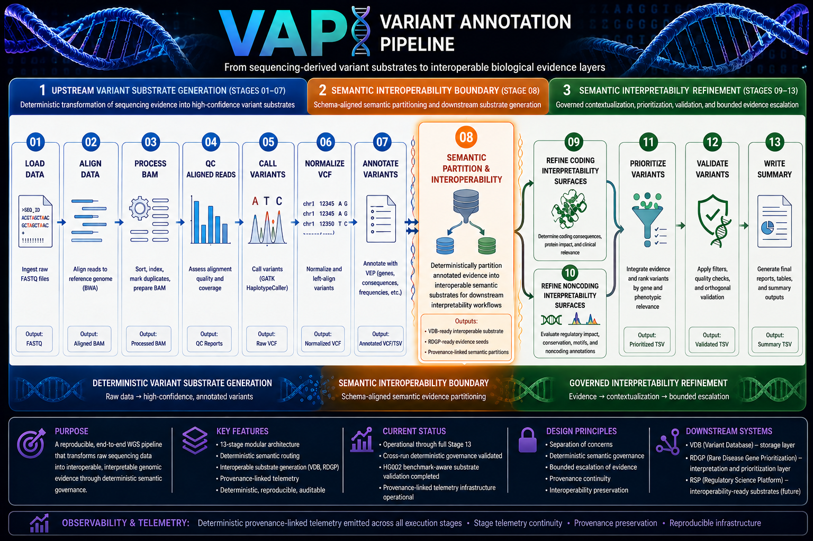
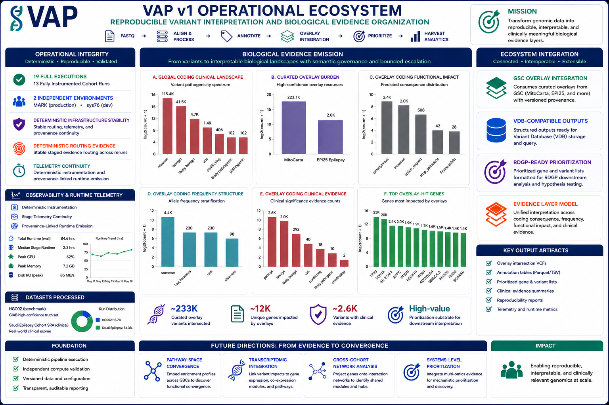

# Variant Annotation Pipeline (VAP)

Deterministic, benchmark-aware genomic variant annotation and semantic reviewability pipeline.


VAP is a traceable genomic evidence infrastructure for transforming sequencing-derived variant substrates into interoperable biological evidence layers.

---



---

# Executive Overview

The Variant Annotation Pipeline (VAP) is a reproducible 13-stage genomic evidence architecture designed to transform sequencing-derived variant substrates into governed, interoperable, and interpretation-oriented semantic evidence layers.

Rather than terminating at variant calling or annotation alone, VAP continues through governed evidence organization, bounded interpretability refinement, provenance-aware prioritization, and interoperability-oriented substrate generation.

The architecture emphasizes:

* semantic governance
* provenance continuity
* representation-aware normalization
* observability-aware execution
* interoperability substrate generation
* bounded evidence escalation
* downstream composability

The resulting ecosystem emits structured evidence surfaces capable of supporting reproducible downstream biological reasoning workflows.

---

# Why VAP Exists

Modern genomic workflows frequently generate technically valid outputs that remain difficult to organize, contextualize, compare, or reuse across downstream interpretation systems.

Several recurrent infrastructure problems emerge in these environments:

* uncontrolled evidence collapse
* fragmented interpretability workflows
* weak interoperability surfaces
* provenance discontinuity
* opaque prioritization logic
* limited downstream composability

VAP was designed as traceable evidence infrastructure rather than a terminal annotation endpoint.

The architecture transforms sequencing-derived evidence into:

* governed semantic substrates
* provenance-linked interpretability layers
* interoperability-oriented evidence products
* reviewability-aware prioritization surfaces
* composable downstream infrastructure interfaces

VAP does not replace biological interpretation or clinical expertise. Instead, the system focuses on reproducible evidence organization, semantic continuity preservation, bounded interpretability refinement, and interoperability-oriented substrate generation.

---

# Pipeline Architecture

## 13-Stage Semantic Evidence Architecture

VAP is organized as a 13-stage execution architecture spanning:

1. upstream variant substrate generation
2. semantic interoperability partitioning
3. downstream interpretability refinement

### Upstream Variant Substrate Generation: Stages 01–07

The upstream execution layer performs:

* sequencing ingestion
* alignment
* BAM processing
* variant calling
* representation-aware normalization
* annotation
* preliminary evidence refinement

These stages establish the normalized upstream substrate boundary used for downstream evidence organization and interpretability refinement.

### Semantic Interoperability Boundary: Stage 08

Stage 08 serves as the architectural center of the VAP ecosystem.

At this boundary, annotated genomic evidence is partitioned into interoperable substrates designed for downstream interpretability refinement and ecosystem-level composability.

Outputs generated at this stage include:

* VDB-ready normalized variant substrates
* RDGP-ready evidence seeds
* provenance-linked semantic partitions
* coding and noncoding interpretability surfaces
* interoperability-oriented evidence layers

This boundary preserves semantic continuity while enabling downstream reuse and composability.

### Semantic Interpretability Refinement: Stages 09–13

The downstream refinement stages apply governed contextualization and bounded interpretability refinement to semantic evidence partitions.

These stages include:

* coding evidence refinement
* noncoding interpretability analysis
* prioritization
* validation-oriented contextualization
* summary substrate generation

The architecture focuses on deterministic semantic organization capable of supporting reproducible downstream interpretation workflows.

---

# Operational Evidence Ecology



VAP emits substantially more than annotated VCFs.

The system produces an operational evidence ecosystem spanning:

* semantic evidence partitions
* overlay burden structures
* telemetry-linked runtime artifacts
* prioritization substrates
* validation-oriented evidence layers
* interoperability products
* provenance-aware summary surfaces

Operational observability is integrated throughout the execution architecture using provenance-linked telemetry, runtime instrumentation, stage summaries, semantic overlay metrics, and interoperability-aware substrate emission.

This operational ecosystem supports reproducible execution behavior, infrastructure-scale observability, interoperability-oriented reuse, and future composable biological reasoning systems.

---

# Semantic Governance Differentiation


VAP differs from conventional genomic prioritization pipelines because it emphasizes governed evidence decomposition rather than simplistic evidence reduction.

Many genomic workflows progressively collapse evidence through restrictive filtering layers until only a small number of variants remain visible for downstream review. Although operationally convenient, this approach can obscure provenance continuity, collapse semantic topology, and limit downstream interoperability.

VAP instead applies governed semantic compression.

The architecture preserves semantic structure while constraining escalation into bounded interpretability and reviewability surfaces.

This approach emphasizes:

* provenance continuity
* governed routing continuity
* bounded escalation
* interoperability preservation
* reviewability governance
* semantic topology retention

Clarity emerges through governed transformation rather than arbitrary reduction.

This governance doctrine became especially visible during the 12-SRA cross-run analyses, where topology preservation, interoperability continuity, and reproducible reviewability structures remained stable across heterogeneous sequencing runs.

---

# Case Studies

The repository contains four operational case studies demonstrating benchmarking validation, reproducibility, interoperability continuity, observability-aware execution, and governed evidence organization.

## HG002 Benchmark-Aware Validation

Representation-aware `hap.py` benchmarking against GIAB HG002 v4.2.1 (GRCh38) truth resources.

Highlights:

* representation-aware normalization
* namespace mediation
* deterministic preprocessing
* provenance continuity
* bounded benchmarking interpretation

**Artifacts**

* [HG002 Benchmark Validation](docs/case_studies/hg002/README.md)

## ERR10619281 Semantic Stability

Deterministic rerun analysis demonstrating preserved semantic governance topology across independent executions.

Highlights:

* semantic routing continuity
* provenance preservation
* reproducible evidence topology
* controlled semantic divergence

**Artifacts**

* [ERR10619281 Semantic Stability](docs/case_studies/err10619281/err10619281_wes_case_study.md)

## ERR10619300 Semantic Evidence Refinery

Governed evidence refinement and interoperability-oriented substrate generation.

Highlights:

* semantic decomposition
* bounded interpretability refinement
* interoperability substrate continuity
* governed reviewability escalation

**Artifacts**

* [ERR10619300 Semantic Evidence Refinery](docs/case_studies/err10619300/err10619300_wes_case_study.md)

## 12-SRA Cross-Run Semantic Governance

Cross-run analysis of deterministic semantic governance across heterogeneous sequencing runs.

Highlights:

* semantic convergence/divergence
* topology continuity
* observability persistence
* interoperability stability
* provenance continuity

**Artifacts**

* [12-SRA Cross-Run Semantic Governance](docs/case_studies/cross_runs/README.md)
* [Cross-Run Artifact Audit Guide](docs/case_studies/cross_runs/how_to_audit_cross_run_artifacts.md)

---

# Ecosystem Interoperability


VAP was designed as composable infrastructure rather than a monolithic endpoint analysis system.

The architecture emits interoperable substrates capable of supporting downstream ecosystem integration through governed interfaces and schema continuity.

Current interoperability targets include:

* VDB: Variant Database
* RDGP: Rare Disease Gene Prioritization
* GSC: Gene Set Consensus
* RSP: future transcriptomic interoperability

This composable infrastructure model emphasizes deterministic routing, semantic continuity, interoperability-aware substrate design, provenance-linked interfaces, and ecosystem-level evidence composability.

The architecture treats interoperable substrate generation as a foundational systems-engineering principle rather than a downstream afterthought.

---

# Repository Structure

```text
variant_annotation_pipeline/
├── config/                 # execution configuration
├── data/                   # data structures, sra-intake, gene-lists, and stage12 analytics
├── development_history/    # production-line probes and logs
├── docs/                   # architecture, governance, case studies
├── pipeline/               # canonical staged codebase
├── results/                # output
├── scripts/                # support utilities
├── src/                    # pipeline orchestration
└── tests/                  # validation and reproducibility
```

The repository contains execution infrastructure, architecture documentation, interoperability contracts, operational case studies, validation workflows, telemetry artifacts, governance documentation, and reproducibility-oriented evidence products.

---

# Reproducibility & Determinism

Determinism within VAP extends beyond runtime behavior alone.

The architecture preserves reproducible behavior across:

* semantic routing
* provenance continuity
* execution identity
* telemetry emission
* interoperability substrate generation
* schema-governed evidence refinement

Reproducibility mechanisms include:

* deterministic stage ordering
* provenance-linked telemetry
* representation-aware normalization
* runtime instrumentation
* schema continuity
* semantic governance constraints
* reproducible benchmarking workflows

This infrastructure model allows VAP evidence organization to remain operationally stable across reruns, heterogeneous sequencing contexts, and cohort-scale comparative analyses.

---

# Current Status

The VAP ecosystem is currently operational through full Stage 13 execution.

Operational validation currently includes HG002 benchmarking, deterministic rerun analysis, and 12-SRA cross-run semantic governance evaluation.

Completed operational milestones thus include:

* HG002 benchmark-aware validation
* deterministic rerun stability analysis
* 12-SRA cross-run semantic governance analysis
* interoperability substrate generation
* provenance-linked telemetry infrastructure
* observability-aware execution instrumentation

The repository remains under active refinement while preserving reproducibility, interoperability continuity, and governed evidence organization principles.

---

# Future Directions

Planned ecosystem extensions include:

* deeper VDB integration
* RDGP interoperability expansion
* transcriptomic interoperability through RSP
* cross-modal semantic convergence
* pathway-scale reasoning
* systems-level prioritization frameworks
* network-oriented evidence integration

These future directions remain grounded in the same architectural principles that govern the current VAP ecosystem:

* deterministic semantic governance
* interoperability continuity
* provenance preservation
* bounded interpretability refinement
* composable infrastructure design

---

# Installation

## Environment Setup

```bash
git clone https://github.com/VitamOrdinatio/variant_annotation_pipeline.git

cd variant_annotation_pipeline

python -m venv .venv
source .venv/bin/activate

pip install -r requirements.txt
```

---

# Example Execution

```bash
python scripts/run_pipeline.py \
    --config config/config.yaml \
    --sample HG002
```

---

# Testing

```bash
pytest tests/
```

---

The repository contains extensive supporting architecture, interoperability, validation, and case-study documentation.

---

# Documentation Index

## Architecture

* [Architecture Documentation](docs/architecture/)
* [Operational Status](docs/architecture/status/)
* [Pipeline Architecture Figure](docs/architecture/status/vap_pipeline_architecture.png)
* [Operational Ecosystem Figure](docs/architecture/status/vap_v1_operational_ecosystem_overview.png)

## Case Studies

* [HG002 Benchmark Validation](docs/case_studies/hg002/README.md)
* [ERR10619281 Semantic Stability](docs/case_studies/err10619281/err10619281_wes_case_study.md)
* [ERR10619300 Semantic Evidence Refinery](docs/case_studies/err10619300/err10619300_wes_case_study.md)
* [12-SRA Cross-Run Semantic Governance](docs/case_studies/cross_runs/README.md)

## Contracts and Validation

* [System Contracts](docs/contracts/system/)
* [Stage Contracts](docs/contracts/stage/)
* [Validation Documentation](docs/validation/)

## Examples

* [Stage-Level Examples](docs/examples/)

---

# Citation

If using VAP in academic or research contexts, please cite the repository and associated case-study documentation.

---

# License

Released under the MIT License.

See [LICENSE](LICENSE) for details.
