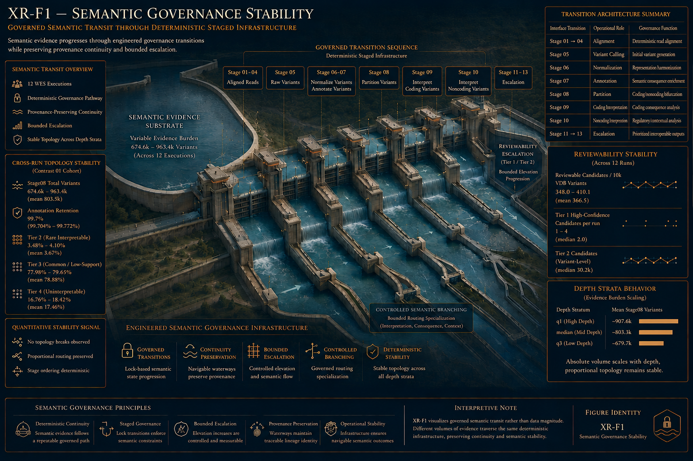
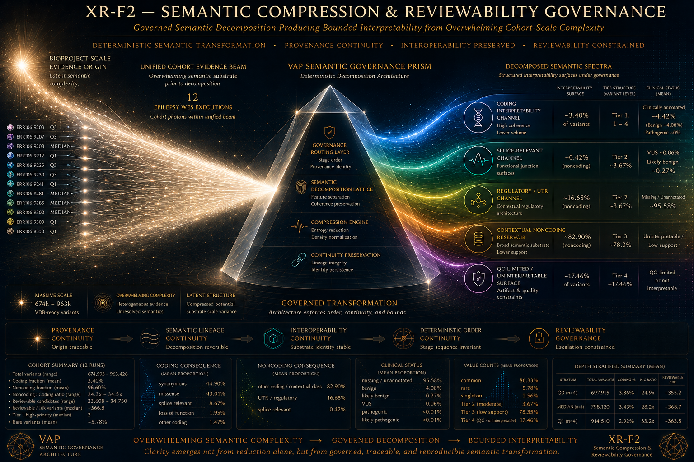
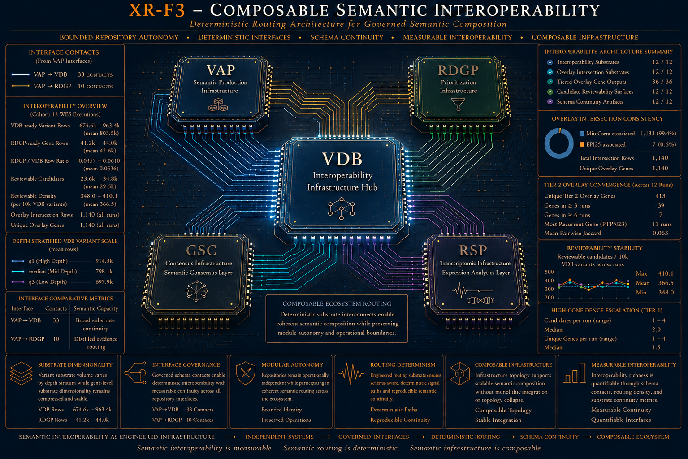
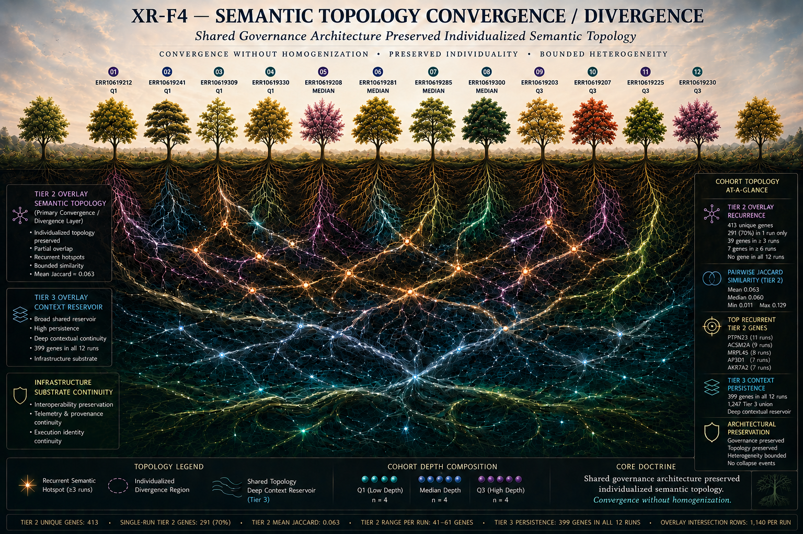
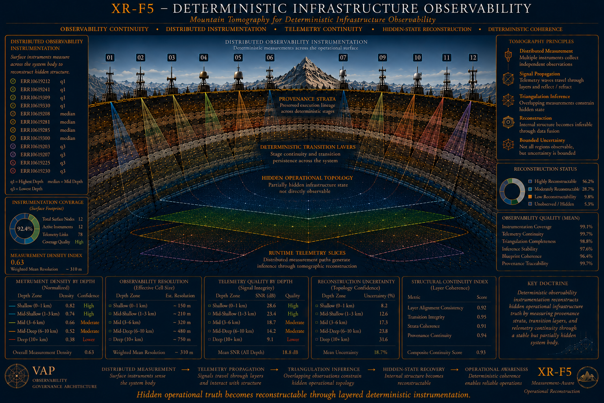

# Cross-Run Case Study

## Deterministic Semantic Infrastructure Under Controlled Sequencing-Depth Diversity

*Figure 1. Semantic governance stability across deterministic staged infrastructure.*

## Study Identity

This case study evaluates whether the Variant Annotation Pipeline (VAP) preserves deterministic semantic infrastructure behavior across a controlled 12-SRA epilepsy whole-exome sequencing cohort stratified by sequencing-depth diversity.

The study focuses on whether independently executed VAP runs remain reconstructable, interoperable, provenance-aware, operationally coherent, and boundedly interpretable under heterogeneous translational substrate conditions.

This is an infrastructure-oriented reproducibility study rather than a clinical validation, diagnostic benchmark, or disease-association framework.

## Central Thesis

> Deterministic semantic governance infrastructure preserves translational interpretability under controlled sequencing-depth diversity.

The cohort intentionally preserves biological and technical heterogeneity: variable candidate burden, individualized semantic topology, non-identical translational structures, and sequencing-depth diversity. The goal is not to force biological convergence. The goal is to determine whether deterministic infrastructure continuity can coexist with preserved translational individuality.

## Cohort Design Philosophy

The cross-run cohort consists of 12 epilepsy-oriented WES SRAs intentionally selected to preserve lower-, median-, and higher-depth execution strata.

This design creates a controlled semantic infrastructure stress environment in which sequencing depth influences substrate magnitude, candidate density, semantic routing pressure, and downstream reviewability burden.

The cohort therefore evaluates:

deterministic semantic governance,
interoperability continuity,
observability continuity,
semantic decomposition stability,
bounded reviewability governance,
and reproducibility-aware reconstruction.

The cohort was not designed to maximize statistical power or support biological inference. It was designed to stress-test semantic infrastructure behavior while preserving controlled translational heterogeneity.

## Deterministic Harvest Infrastructure

The cross-run case study depends on deterministic harvesting infrastructure capable of reconstructing comparable semantic substrate across all 12 independently executed VAP runs.

The harvesting layer deterministically extracts governance continuity substrate, interoperability-oriented evidence products, observability structures, semantic decomposition artifacts, reviewability-oriented escalation summaries, and provenance-governed transition systems.

This prevents the cross-run ecosystem from becoming a loose collection of manually curated outputs. Instead, the comparison architecture emerges from deterministic semantic extraction, provenance-preserving reconstruction, and reproducibility-aware infrastructure synthesis.

VAP is therefore positioned not merely as a terminal annotation workflow, but as reproducibility-aware semantic infrastructure: a governed semantic transit system, interoperability-oriented evidence generator, provenance-preserving reconstruction substrate, and bounded interpretability architecture.

---

# The Seven Contrast Architecture

*Figure 2. Semantic compression and reviewability governance under cohort-scale variant burden.*

The cross-run ecosystem is organized into seven deterministic contrast systems. Each contrast evaluates a distinct semantic infrastructure legitimacy domain while contributing to a coupled architecture.

| Contrast    | Infrastructure Domain                         | Primary Systems Question                                                                   |
| ----------- | --------------------------------------------- | ------------------------------------------------------------------------------------------ |
| Contrast 01 | deterministic semantic governance continuity  | Does governed semantic transit remain stable across controlled sequencing-depth diversity? |
| Contrast 02 | interoperability substrate continuity         | Does downstream semantic routing remain composable and reproducible?                       |
| Contrast 03 | reconstructable observability continuity      | Can semantic infrastructure remain operationally inferable and provenance-aware?           |
| Contrast 04 | individualized semantic topology preservation | Can deterministic governance coexist with translational individuality?                     |
| Contrast 05 | semantic decomposition continuity             | Can large semantic burden be partitioned into bounded interpretability structures?         |
| Contrast 06 | bounded reviewability continuity              | Can semantic escalation remain reproducibly governed and operationally reviewable?         |
| Contrast 07 | provenance-governed transition determinism    | Can provenance continuity preserve reconstructable execution governance?                   |

Together, the contrasts evaluate reproducibility-aware semantic infrastructure continuity rather than biological convergence, candidate identity replication, or disease-causality interpretation.

## Coupled Infrastructure Topology

The seven contrasts form a coupled semantic infrastructure topology:

- governance stabilizes interoperability,
- interoperability stabilizes decomposition continuity,
- decomposition continuity stabilizes reviewability,
- observability stabilizes provenance reconstruction,
- and provenance continuity closes the reproducibility loop.

Together, these layers form the interpretive backbone of the cross-run case study.

## Semantic Compression & Reviewability Governance

A dominant finding across the architecture is that semantic complexity can remain governable under deterministic infrastructure continuity.

The ecosystem preserves large semantic burden, heterogeneous candidate topology, and individualized semantic structures while evaluating whether semantic decomposition, bounded interpretability, reviewability governance, and provenance-preserving escalation remain stable.

XR-F2 visualizes this principle: large-scale semantic substrate can be decomposed into bounded reviewability structures without collapsing into uncontrolled semantic dispersion or reviewer-scale overload.

## XR Figure Traversal

The XR figures are not decorative illustrations. They function as visual semantic doctrine anchors for the case study.

Recommended traversal order:

| Order | XR Figure | Dominant Role |
| --- | --- | --- |
| 01 | XR-F1 | semantic governance stability |
| 02 | XR-F2 | semantic compression and reviewability governance |
| 03 | XR-F3 | composable semantic interoperability |
| 04 | XR-F4 | semantic topology convergence / divergence |
| 05 | XR-F5 | deterministic infrastructure observability |

This ordering supports conceptual pacing: governance, compression, interoperability, synthesis, then observability.

---

# Composable Semantic Interoperability

*Figure 3. Composable semantic interoperability across VAP, VDB, RDGP, GSC, and RSP-facing infrastructure.*

The cross-run ecosystem positions VAP as composable semantic infrastructure rather than an isolated annotation workflow.

The architecture evaluates whether VAP outputs remain:

* interoperable,
* semantically stable,
* provenance-preserving,
* operationally transferable,
* and reconstructably composable

across broader translational infrastructure environments.

## VAP Within The Repository Ecosystem

VAP participates in a larger semantic infrastructure topology:

* **VAP** produces deterministic semantic substrate.
* **VDB** provides interoperability-oriented evidence warehousing infrastructure.
* **RDGP** provides downstream prioritization and translational synthesis infrastructure.
* **GSC** provides phenotype-aware semantic evidence overlay infrastructure.
* **RSP** represents future RNA-seq-oriented ecosystem expansion.

This topology is important because downstream translational infrastructure requires stable semantic evidence products, provenance-preserving interface continuity, and reconstructable semantic routing.

## Contrast 02: Interoperability Layer

Contrast 02 is the dominant interoperability layer. It evaluates whether downstream semantic routing remains composable, transferable, and reproducible across heterogeneous but controlled execution environments.

The major systems claim is not that VAP produces clinically correct downstream results. The claim is that VAP can produce semantically stable, provenance-aware infrastructure products suitable for downstream integration.

This supports the broader interpretation of VAP as an ecosystem component rather than a terminal pipeline artifact.

---

# Cross-Run Systems Synthesis

*Figure 4. Semantic topology convergence/divergence showing preserved individuality under shared governance.*

The seven contrasts collectively evaluate whether deterministic semantic governance continuity remains preserved across heterogeneous semantic burden, individualized translational topology, variable candidate architectures, and controlled sequencing-depth diversity.

The central synthesis finding is:

> deterministic semantic governance continuity can coexist with preserved translational individuality.

## Preserved Individualized Topology

The cross-run architecture intentionally preserves non-identical candidate structures, heterogeneous semantic burden, and individualized topology. It does not force semantic homogenization or candidate identity convergence.

Yet despite this preserved individuality, the ecosystem remains reconstructable, interoperable, provenance-preserving, semantically composable, and operationally coherent.

XR-F4 visualizes this principle: convergence occurs at the infrastructure-governance level, not by flattening individualized translational topology.

## Emergent Infrastructure Properties

Across the seven contrast systems, the ecosystem preserves deterministic governance continuity, interoperability topology, reconstructable observability, semantic decomposition continuity, bounded reviewability organization, provenance-preserving reconstruction continuity, and reproducibility-aware interpretability.

These properties are coupled. The case study therefore demonstrates systems-level semantic infrastructure continuity rather than isolated metric stability.

## Reproducibility Is Not Correctness

A key interpretive boundary is the distinction between reproducibility and correctness.

The cross-run ecosystem demonstrates deterministic reconstruction continuity, provenance-aware semantic governance, interoperability continuity, and bounded interpretability stability. It does not establish biological truth, diagnostic validity, clinical correctness, or disease causality.

That distinction strengthens the case study: reproducibility is treated as infrastructure continuity, not as proof of clinical truth.

---

# Deterministic Infrastructure Observability

*Figure 5. Deterministic infrastructure observability through telemetry, provenance, and reconstruction layers.*

The cross-run ecosystem emphasizes provenance-preserving reconstruction, reconstructable observability, deterministic transition continuity, and reproducibility-aware infrastructure legitimacy.

The architecture preserves telemetry continuity structures, transition-oriented provenance systems, deterministic reconstruction substrate, semantic traceability, and audit-oriented infrastructure visibility.

XR-F5 visualizes this auditability layer.

## Reconstructable Observability

Contrast 03 evaluates whether independently executed VAP runs remain telemetry-visible, provenance-linked, and operationally interpretable across controlled sequencing-depth diversity.

This matters because hidden-state execution weakens reproducibility. The case study therefore treats observability as a semantic infrastructure property: infrastructure behavior should remain inferable, reconstructable, and provenance-aware.

## Provenance-Governed Transition Continuity

Contrast 07 evaluates deterministic transition ordering, provenance continuity, transition reconstruction legitimacy, and semantic routing stability.

This layer closes the reproducibility loop. Without provenance continuity, the ecosystem would risk semantic fragmentation, auditability collapse, and interpretive instability.

The major systems claim is:

> deterministic semantic governance continuity can remain reconstructably auditable across independently executed translational infrastructure runs.

## Transparency Philosophy

The repository intentionally preserves deterministic reconstruction substrate, provenance-linked telemetry, interoperability structures, semantic decomposition artifacts, and audit-oriented reconstruction outputs.

This prioritizes semantic traceability and infrastructure transparency over presentation minimalism. Reviewers are not expected to inspect every artifact, but the substrate exists to support auditability and reproducibility review.

---

## Directory Guide

The `cross_runs/` directory contains both the focused 12-SRA epilepsy WES cross-run case study and shared case-study support artifacts used elsewhere in the VAP documentation.

| Path                                            | Role                                                                           | Scope                                                                                                |
| ----------------------------------------------- | ------------------------------------------------------------------------------ | ---------------------------------------------------------------------------------------------------- |
| `contrasts/`                                    | Systematic 7-contrast reconstruction substrate organized by contrast, then SRA | 12-SRA epilepsy WES cohort only                                                                      |
| `figures/`                                      | Final XR figure atlas used by this README                                      | 12-SRA cross-run case study                                                                          |
| `cross_run_tables/`                             | Shared case-study support tables and run-history summaries                     | includes 12-SRA rows plus broader VAP provenance/support rows                                        |
| `cross_run_figures/`                            | Earlier cross-run harvest ecosystem figure artifacts                           | shared legacy/support figure context; still cited by locked ERR10619281 and ERR10619300 case studies |
| `vap_depth_stratified_epilepsy_panel_design.md` | Cohort design rationale for the depth-stratified epilepsy WES panel            | 12-SRA cross-run case study                                                                          |

The most important distinction is that `contrasts/` is the focused 12-SRA reconstruction substrate for this case study, while `cross_run_tables/` also preserves shared run-history and case-study support tables for repository-wide traceability.

---

# Artifact Navigation & Review Strategy

The cross-run case study preserves public-facing reproducibility substrate, while this README provides the guided synthesis layer rather than the complete evidence archive. Reviewers should treat `contrasts/` as the primary 12-SRA audit substrate, `figures/` as the final XR figure atlas, and `cross_run_tables/` as shared support tables that include both cohort-specific rows and broader VAP run-history context.

Recommended review path:

| Review Depth     | Suggested Focus                                                      |
| ---------------- | -------------------------------------------------------------------- |
| Fast orientation | README + XR figures                                                  |
| Systems review   | Seven contrast table + systems synthesis                             |
| Technical review | contrast summaries, telemetry, interoperability outputs              |
| Deep audit       | deterministic reconstruction artifacts and provenance-linked outputs |

The repository should therefore be read as a layered infrastructure artifact:

* README for synthesis,
* figures for semantic doctrine anchors,
* contrast outputs for systems evidence,
* reconstruction artifacts for auditability,
* and provenance-linked outputs for reproducibility review.

---

## Guided Artifact Traversal Companion

The XR figures and synthesis sections in this README intentionally compress a much larger deterministic reconstruction substrate.

Reviewers interested in traversing the underlying cross-run artifact ecosystem should consult the companion audit guide:

[`how_to_audit_cross_run_artifacts.md`](how_to_audit_cross_run_artifacts.md)

This companion document functions as the operational-facing counterpart to the present conceptual synthesis layer.

Where this README emphasizes:

* systems interpretation,
* semantic governance architecture,
* interoperability synthesis,
* provenance continuity,
* and infrastructure-level conclusions,

the audit guide emphasizes:

* practical traversal strategy,
* contrast-by-contrast reconstruction navigation,
* hyperlink-oriented artifact inspection,
* provenance-aware audit review,
* and cross-validation against independently generated single-run case studies.

Importantly, the audit guide demonstrates how independently harvested cross-run artifacts can be compared against the official single-run `ERR10619281` case study to validate semantic continuity across distinct `run_<id>` executions.

The companion guide therefore acts as:

* a reconstruction navigation manual,
* a reproducibility-validation bridge,
* and a practical audit entry point into the broader cross-run semantic infrastructure substrate.

Recommended progression:

| Review Goal                             | Recommended Entry Point                             |
| --------------------------------------- | --------------------------------------------------- |
| Conceptual infrastructure synthesis     | `README.md`                                         |
| Practical artifact traversal            | `how_to_audit_cross_run_artifacts.md`               |
| Deep single-run semantic interpretation | `../err10619281/err10619281_wes_case_study.md`      |
| Reproducibility/provenance inspection   | `../err10619281/err10619281_wes_reproducibility.md` |

Together, these documents form a layered review architecture spanning:

1. conceptual synthesis,
2. operational traversal,
3. deterministic reconstruction,
4. provenance-aware observability,
5. and independently reproducible semantic validation.

---

# Scientific Boundaries

This case study does not claim:

* clinical validity,
* diagnostic correctness,
* therapeutic relevance,
* disease causality,
* epidemiological inference,
* or population-scale generality.

It evaluates infrastructure behavior: whether deterministic semantic governance, interoperability, provenance, observability, decomposition, and reviewability remain coherent under controlled sequencing-depth diversity.

The cohort is intentionally limited to 12 epilepsy-oriented WES SRAs. This provides meaningful infrastructure stress diversity, but it is not a universal benchmark.

The XR figures should likewise be interpreted as visual semantic infrastructure doctrine, not biological models or diagnostic illustrations.

---

# Future Directions

Future work may extend the infrastructure study through broader sequencing-depth distributions, additional disease-oriented WES cohorts, heterogeneous sequencing platforms, expanded benchmarking systems, richer telemetry architectures, more granular semantic reconstruction layers, and broader interoperability integration across VAP, VDB, RDGP, GSC, and RSP.

Future expansion should preserve the same interpretive restraint: broader infrastructure evaluation does not automatically imply biological correctness or clinical validity.

---

# Closing Interpretation

The cross-run case study demonstrates that deterministic semantic infrastructure can preserve:

* governance continuity,
* interoperability continuity,
* reconstructable observability,
* semantic decomposition continuity,
* bounded reviewability organization,
* provenance-preserving reconstruction,
* and reproducibility-aware interpretability continuity

without collapsing semantic topology, translational individuality, infrastructure transparency, or systems-level interpretability.

The broader architecture therefore establishes VAP as a:

> reproducibility-aware deterministic semantic infrastructure ecosystem

capable of supporting composable interoperability, provenance-aware reconstruction, bounded interpretability, and systems-level translational infrastructure coherence across heterogeneous but controlled semantic substrate environments.
