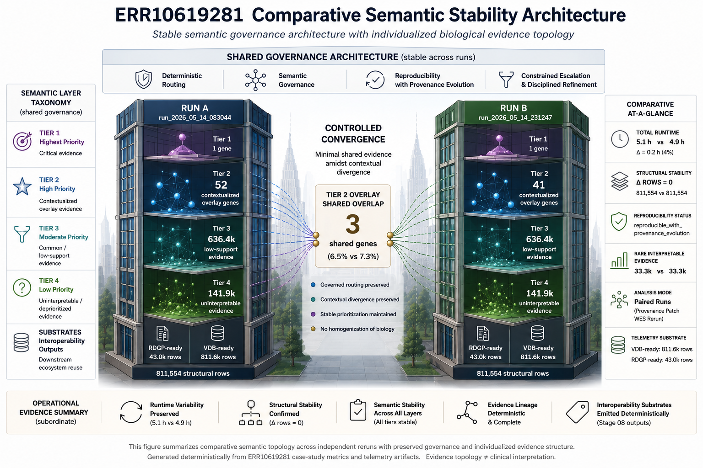
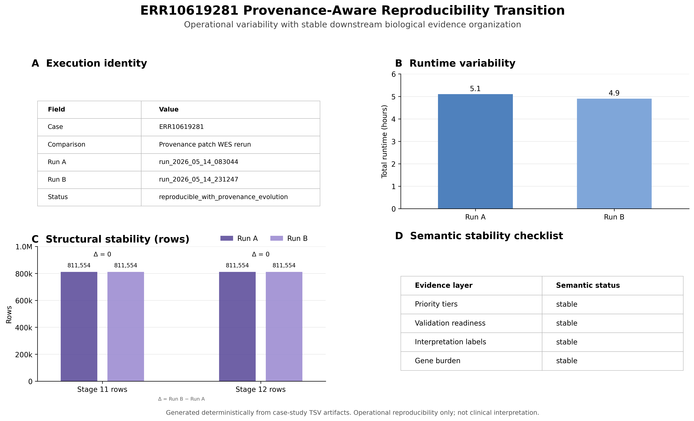
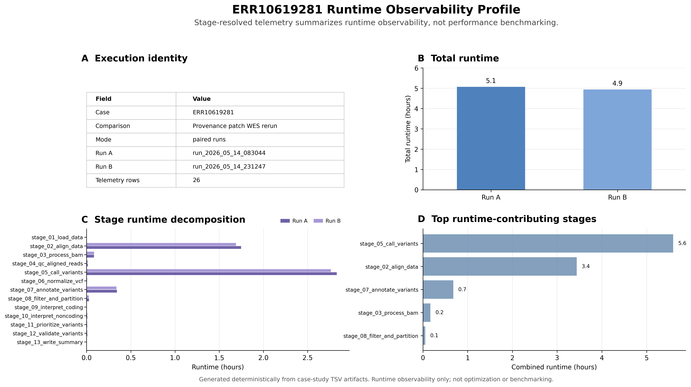
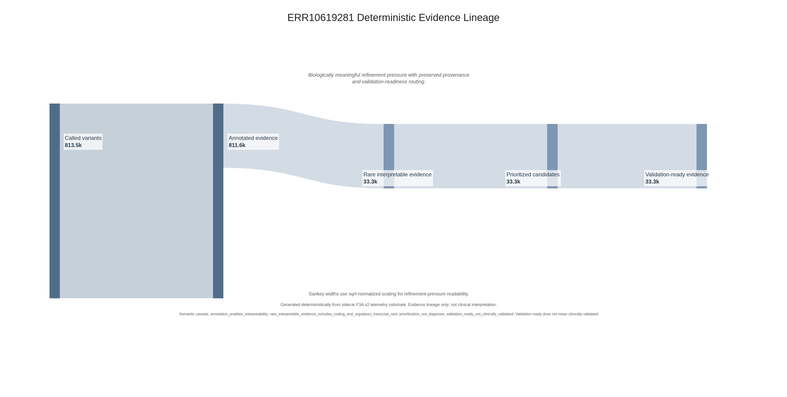
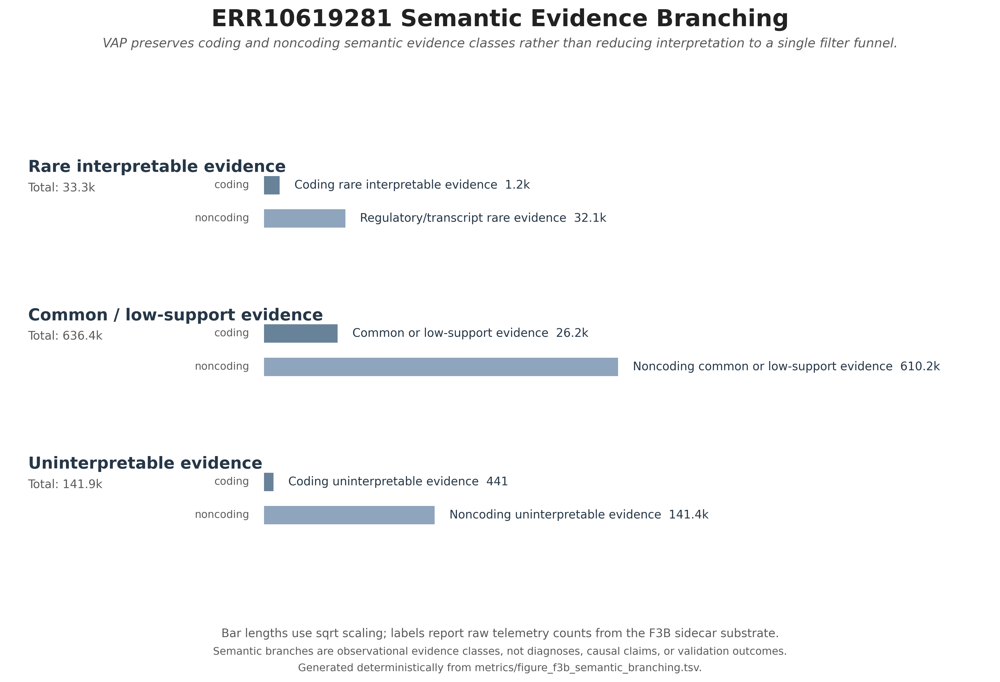
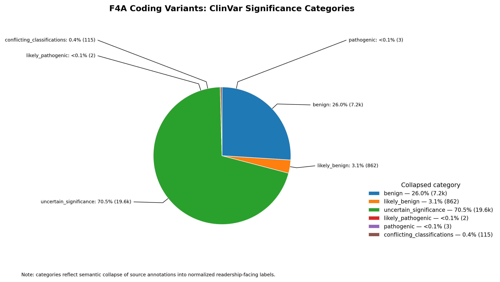
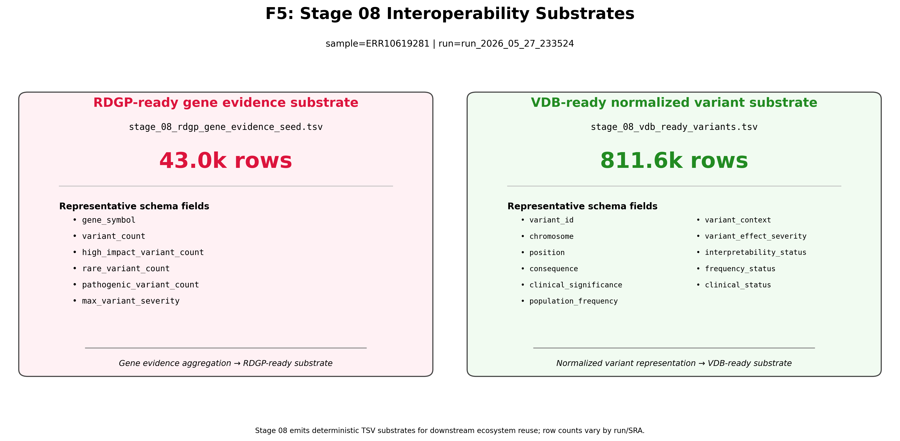

# ERR10619281 WES Case Study

## Deterministic Semantic Evidence Generation and Comparative Observability Analysis

---

# 1. Executive Summary

This case study documents the execution of the Variant Annotation Pipeline (VAP) against the epilepsy-associated whole-exome sequencing (WES) sample:

```text
ERR10619281
```

within a broader depth-stratified epilepsy cohort framework.

The objective of this case study is not clinical interpretation or diagnostic reporting. Instead, the study evaluates whether deterministic semantic evidence organization, telemetry observability, semantic prioritization behavior, and interoperability substrate generation remain stable across an independent epilepsy WES cohort relative to the flagship:

```text
ERR10619300
```

semantic evidence case study.

Operationally, the ERR10619281 execution demonstrated:

* deterministic provenance-aware execution,
* stable runtime observability telemetry,
* reproducible semantic evidence routing,
* harmonized Stage 12 semantic extraction behavior,
* controlled validation escalation,
* and stable interoperability substrate generation.

Comparative analysis against ERR10619300 further demonstrated:

```text
stable semantic governance architecture
with individualized biological evidence topology.
```

Collectively, these results support the broader hypothesis that VAP semantic evidence organization behavior generalizes reproducibly across independent epilepsy WES cohorts while preserving individualized contextual evidence structure.

---

# Comparative Semantic Stability Architecture



**Figure 1.** Comparative semantic stability architecture across paired epilepsy WES executions demonstrating stable semantic governance architecture with individualized biological evidence topology. Comparative analysis illustrates preserved semantic routing, stable interoperability substrate generation, and controlled contextual divergence across independent executions. Generated deterministically from telemetry and semantic substrate artifacts.

# 2. Background and Context

The Variant Annotation Pipeline (VAP) was developed to support deterministic semantic evidence generation across translational genomics workflows. Rather than functioning solely as a variant annotation utility, VAP organizes sequencing-derived evidence into telemetry-aware semantic infrastructure products suitable for downstream interoperability, prioritization, and comparative synthesis.

ERR10619281 represents an independent epilepsy-associated WES cohort executed within a broader depth-stratified epilepsy sequencing framework consisting of multiple sequencing runs distributed across quartile-scale sequencing depths. Within this broader panel, ERR10619281 functions as a median-depth comparative semantic validation slice.

Importantly, this case study is exploratory and infrastructure-oriented in nature. No diagnostic assertions, causal claims, or clinical reporting activities are performed. Instead, the emphasis is placed on evaluating:

* reproducibility,
* provenance continuity,
* semantic refinement structure,
* contextual evidence organization,
* and interoperability substrate preservation.

This study additionally evaluates whether semantic evidence organization behavior observed previously in ERR10619300 remains structurally coherent within an independent epilepsy-associated WES cohort.

---

# 3. Reproducibility and Provenance Stability

## Deterministic Execution Stability

Operational reproducibility was first evaluated using provenance-aware deterministic rerender assessment and runtime telemetry observability analysis.

Figure 2 summarizes deterministic provenance transition stability across rerendered semantic evidence products.

## Provenance Transition Stability



The resulting provenance topology demonstrated stable figure regeneration behavior and consistent semantic artifact lineage organization across rerender operations.

Importantly, deterministic artifact regeneration behavior matched the manually generated semantic visualization suite used previously during exploratory development. This result demonstrates that canonical figure generation logic was successfully integrated directly into the operational VAP execution framework.

---

## Runtime Observability and Telemetry Structure

Figure 3 summarizes runtime telemetry observability behavior across the ERR10619281 execution lifecycle.

## Runtime Observability Profile



Runtime telemetry demonstrated:

* stable stage decomposition,
* deterministic telemetry emission,
* reproducible runtime monitoring structure,
* and complete observability continuity throughout pipeline execution.

The runtime telemetry structure further reinforced that VAP execution now behaves as:

```text
a governed reproducible semantic infrastructure system
```

rather than as a transient annotation-only workflow.

Execution occurred on the MARK high-memory Linux execution environment consisting of:

* dual Intel Xeon Gold 6230 processors,
* 40 logical CPU cores,
* 256 GB RAM,
* NVIDIA RTX-class GPU infrastructure,
* and Debian 12 operating environment.

Importantly, the case study emphasizes infrastructure reproducibility and telemetry governance rather than hardware performance benchmarking.

---

# 4. Semantic Evidence Routing Architecture

## Deterministic Evidence Lineage

Figure 4 summarizes deterministic semantic evidence lineage organization across the Stage 12 refinement architecture.

## Deterministic Evidence Lineage



The resulting semantic topology demonstrated stable semantic attrition structure across evidence refinement boundaries while preserving provenance continuity throughout prioritization transitions.

Importantly, the semantic lineage topology remained structurally similar to the topology previously observed in ERR10619300 despite differences in individualized biological evidence substrate.

This supports the broader hypothesis that:

```text
semantic refinement structure generalizes reproducibly
across independent epilepsy WES cohorts.
```

---

## Semantic Branching and Prioritization Structure

Figure 5 summarizes semantic branching behavior and interpretability-aware evidence routing.

## Semantic Branching Architecture



The resulting topology demonstrated:

* stable contextual prioritization behavior,
* constrained validation escalation,
* controlled semantic compression,
* and disciplined interpretability-aware triage.

Importantly, the semantic branching structure demonstrated that:

* rare biologically impactful evidence does not automatically escalate,
* clinically contextualized evidence does not universally trigger validation routing,
* and contextual overlays materially reshape prioritization topology.

This behavior strongly supports the interpretation that VAP semantic routing operates through deterministic governance-aware contextual refinement rather than naive burden accumulation alone.

---

# 5. Stage 12 Semantic Topology

## Harmonized Semantic Extraction Doctrine

Representative exemplar extraction followed deterministic semantic extraction doctrine using harmonized Stage 12 bucket taxonomy across both:

```text
ERR10619281
```

and:

```text
ERR10619300.
```

The resulting bucket architecture enabled reproducible semantic evidence extraction across:

* validation-routed contextualized evidence,
* rare-impact escalation layers,
* semantic restraint exemplars,
* contextualized overlay substrates,
* and noncoding preservation layers.

---

## Semantic Tier Structure

Stage 12 semantic topology demonstrated substantial semantic refinement pressure while maintaining interpretability-aware prioritization structure.

The overall evidence substrate remained dominated by:

* noncoding evidence,
* low-priority background burden,
* and contextually ambiguous evidence structure.

However, validation escalation remained tightly constrained.

Importantly:

* rare biologically impactful evidence frequently failed escalation thresholds,
* clinically supported evidence did not universally trigger prioritization,
* and contextual overlays materially altered semantic routing behavior.

This strongly supports the interpretation that semantic governance structure remained disciplined and reproducible.

Figures 6A–6C examine semantic composition for coding variants with respect to ClinVar significance, molecular consequence, and population frequency bins:

| Semantic Composition Facet (**CODING**)                                             | Facet Utility                               |
| ----------------------------------------------------------------------------------- | ------------------------------------------- |        
| [Figure 6A. ClinVar Significance](figures/ERR10619281_f4a_clinvar_significance.png) | Distribution of ClinVar significance fields |
| [Figure 6B. Molecular Consequence](figures/ERR10619281_f4a_consequence.png)        | Distribution of molecular consequences      | 
| [Figure 6C. Population Frequency Bins](figures/ERR10619281_f4a_pop_freq_bins.png)   | Population frequency bin distributions      |

Figures 7A–7C explore the semantic compositional distributions for noncoding variants with respect to ClinVar significance, molecular consequence, and population frequency bins:

| Semantic Composition Facet (**NONCODING**)                                          | Facet Utility                               |
| ----------------------------------------------------------------------------------- | ------------------------------------------- |        
| [Figure 7A. ClinVar Significance](figures/ERR10619281_f4b_clinvar_significance.png) | Distribution of ClinVar significance fields |
| [Figure 7B. Molecular Consequence](figures/ERR10619281_f4b_consequence.png)         | Distribution of molecular consequences      | 
| [Figure 7C. Population Frequency Bins](figures/ERR10619281_f4b_pop_freq_bins.png)   | Population frequency bin distributions      |


Coding versus noncoding semantic differences can be observed across each compositional facet type. For example, the uncertain significance category dominates ClinVar Significance facets for noncoding compared with coding variant candidates.

 


Such a pattern is consistent with VAP's fundamental design of preserving the biological substrate, effectively future-proofing for when tools such as AlphaGenome achieve sufficient maturity for deeper semantic analysis.

---

## Rare-Impact Semantic Refinement

Comparative rare-impact coding refinement analysis demonstrated highly stable semantic topology across ERR10619281 and ERR10619300.

Both cohorts produced approximately:

```text
~1,000 rare-impact coding variants
```

prior to contextual refinement.

Despite individualized biological evidence topology differences, the broader semantic refinement architecture remained highly stable across both runs.

This is an important systems-level observation because it demonstrates:

```text
stable semantic refinement architecture
despite individualized contextual evidence composition.
```

---

# 6. Representative Semantic Evidence Exemplars

## Tier 1 Contextualized Evidence

The harmonized Stage 12 extraction framework identified a highly constrained Tier 1 contextualized evidence substrate.

Importantly, Tier 1 escalation remained extremely selective and reproducible across cohorts.

For ERR10619281, the Tier 1 contextualized substrate remained limited and tightly constrained, supporting the interpretation that VAP semantic routing avoids indiscriminate escalation behavior.

---

## Tier 2 Contextualized Overlay Substrate

Tier 2 epilepsy- and mitochondrial-contextualized overlays demonstrated biologically plausible but individualized semantic topology.

Representative contextualized Tier 2 genes included examples associated with:

* neurological function,
* developmental regulation,
* mitochondrial organization,
* and translationally relevant contextual overlay intersections.

Importantly, these exemplars are presented as:

```text
representative semantic routing exemplars
```

rather than as:

```text
candidate disease-causing variants.
```

This distinction is critical because the objective of the case study is semantic infrastructure evaluation rather than diagnostic interpretation.

---

## Semantic Restraint and Controlled Deprioritization

One of the most important observations in the ERR10619281 execution was the preservation of disciplined semantic restraint behavior.

Specifically:

* rare biologically impactful evidence frequently failed escalation thresholds,
* clinically contextualized evidence was sometimes deprioritized,
* and clinically supported evidence did not automatically trigger validation routing.

This behavior demonstrates that VAP semantic governance architecture does not collapse into naive burden-driven prioritization behavior.

Instead, prioritization structure remained:

* contextual,
* interpretability-aware,
* provenance-preserving,
* and semantically constrained.

---

# 7. Comparative Analysis vs ERR10619300

## Shared Semantic Governance Architecture

Comparative analysis between:

```text
ERR10619281
```

and:

```text
ERR10619300
```

demonstrated highly stable semantic governance architecture across independent epilepsy WES cohorts.

Importantly:

* semantic refinement topology remained stable,
* telemetry observability remained coherent,
* prioritization behavior remained disciplined,
* and interoperability substrate structure remained reproducible.

This suggests that VAP semantic governance behavior generalizes reproducibly across independent epilepsy-associated sequencing cohorts.

---

## Individualized Biological Evidence Topology

Despite stable semantic architecture, individualized contextual evidence topology remained strongly preserved across both cohorts.

Comparative Tier 2 overlay analysis demonstrated:

* limited but real contextualized convergence,
* substantial individualized overlay composition,
* and stable contextual refinement structure.

This is likely one of the most important conceptual observations of the case study.

Operationally, the comparative framework demonstrated:

```text
stable semantic governance architecture
with individualized biological evidence topology.
```

This represents the ideal balance between:

* deterministic semantic infrastructure behavior,
* and preservation of individualized biological evidence structure.

---

## Controlled Semantic Convergence

The comparative overlay analysis additionally demonstrated that semantic contextualization materially reshapes prioritization topology.

Naive raw burden accumulation layers were frequently dominated by:

* large polymorphic genes,
* repetitive burden-heavy loci,
* and annotation-density effects.

However, contextual overlay-aware semantic refinement substantially reshaped the resulting evidence topology into a more interpretable neurological contextualization substrate.

This strongly supports the future role of:

* contextual overlays,
* semantic governance,
* VDB persistence,
* and future RDGP prioritization architecture.

---

# 8. Interoperability and Downstream Readiness

## Stage 08 Interoperability Preservation

Figure 8 summarizes Stage 08 interoperability substrate organization.

## Interoperability Substrates



Stage 12 semantic extraction products were intentionally preserved without collapsing contextual evidence complexity, supporting:

* future VDB persistence,
* future RDGP prioritization,
* future noncoding analytical workflows,
* and future regulatory interpretation infrastructure.

Importantly, semantic evidence products were preserved as structured interoperability substrates rather than flattened terminal reports.

This philosophy is central to the broader VAP ecosystem architecture.

---

## Future Ecosystem Readiness

The ERR10619281 execution now demonstrates that VAP semantic products are capable of supporting future:

* VDB evidence persistence,
* RDGP semantic prioritization,
* cross-run synthesis,
* overlay-aware contextual analytics,
* and future noncoding interpretation workflows.

Importantly, this infrastructure philosophy prioritizes:

```text
preserve semantic substrate now,
reason over it later.
```

This doctrine strongly supports future ecosystem extensibility.

---

# 9. Limitations

This case study is exploratory and infrastructure-oriented in scope.

Importantly:

* no diagnostic interpretations were performed,
* no clinical reporting activities were performed,
* no causal assertions were made,
* and no statistical disease-association claims were attempted.

Additional limitations include:

* limited cohort scale,
* WES-specific assay constraints,
* absence of orthogonal validation,
* lack of transcriptomic integration,
* and incomplete noncoding regulatory interpretation capability.

Accordingly, the results should be interpreted as demonstrating semantic infrastructure reproducibility and comparative semantic governance behavior rather than clinical interpretation.

---

# 10. Conclusions

The ERR10619281 epilepsy-associated WES execution demonstrated:

* deterministic semantic evidence generation,
* stable runtime observability,
* reproducible semantic refinement structure,
* disciplined prioritization behavior,
* comparative semantic governance stability,
* and interoperability substrate readiness.

Comparative analysis against ERR10619300 further demonstrated:

```text
stable semantic governance architecture
with individualized biological evidence topology.
```

Collectively, these observations support the broader conclusion that VAP semantic evidence organization behavior generalizes reproducibly across independent epilepsy-associated WES cohorts while preserving individualized contextual evidence structure.

Operationally, the ERR10619281 execution further demonstrates that VAP has evolved beyond a simple annotation workflow into:

```text
a deterministic semantic evidence-generation ecosystem
with comparative translational genomics infrastructure layers.
```

---

# 11. Artifact Inventory Appendix

## Figures List for VAP Execution of ERR10619281

* [Figure 1. ERR10619281 Comparative Semantic Stability Architecture](figures/err10619281_hero_semantic_stability_architecture_v2.png)
* [Figure 2. ERR10619281 Provenance Transition Stability](figures/err10619281_f1_provenance_transition_summary.png)
* [Figure 3. ERR10619281 Runtime Observability Profile](figures/err10619281_f2_runtime_observability_profile.png)
* [Figure 4. ERR10619281 Deterministic Evidence Lineage](figures/ERR10619281_f3a_deterministic_evidence_lineage.png)
* [Figure 5. ERR10619281 Semantic Branching Architecture](figures/ERR10619281_f3b_semantic_branching.png)
* [Figure 6A. ERR10619281 Coding Semantic Composition: ClinVar Significance](figures/ERR10619281_f4a_clinvar_significance.png)
* [Figure 6B. ERR10619281 Coding Semantic Composition: Molecular Consequence](figures/ERR10619281_f4a_consequence.png)
* [Figure 6C. ERR10619281 Coding Semantic Composition: Population Frequency Bins](figures/ERR10619281_f4a_pop_freq_bins.png)
* [Figure 7A. ERR10619281 Noncoding Semantic Composition: ClinVar Significance](figures/ERR10619281_f4b_clinvar_significance.png)
* [Figure 7B. ERR10619281 Noncoding Semantic Composition: Molecular Consequence](figures/ERR10619281_f4b_consequence.png)
* [Figure 7C. ERR10619281 Noncoding Semantic Composition: Population Frequency Bins](figures/ERR10619281_f4b_pop_freq_bins.png)
* [Figure 8. ERR10619281 Interoperability Substrates](figures/ERR10619281_f5_interoperability_substrates.png)

---

## Supporting Tables for VAP Execution of ERR10619281

* [Table 1. ERR10619281 Priority Tier Summary](tables/priority_tier_summary.tsv)
* [Table 2. ERR10619281 Clinical Status Summary](tables/clinical_status_summary.tsv)
* [Table 3. ERR10619281 Interpretation Label Summary](tables/interpretation_label_summary.tsv)
* [Table 4. ERR10619281 Candidate Variant Reviewability Readiness](tables/candidate_reviewability_readiness.tsv)
* [Table 5. ERR10619281 Runtime Stage Summary](tables/runtime_stage_summary.tsv)
* [Table 6. ERR10619281 Provenance Summary](tables/provenance_summary.tsv)
* [Table 7. ERR10619281 Mitochondrial / Epilepsy Overlay for Coding Variants with Clinical Evidence](tables/overlay_gene_coding_clinical_evidence.tsv)
* [Table 8. ERR10619281 Mitochondrial / Epilepsy Overlay for Coding Variants with Frequency Profiles](tables/overlay_gene_coding_frequency_profiles.tsv)
* [Table 9. ERR10619281 Mitochondrial / Epilepsy Overlay for Coding Variants with Functional Impacts](tables/overlay_gene_coding_functional_impact.tsv)
* [Table 10. ERR10619281 Gene List Overlay Intersections](tables/gene_list_overlay_intersections.tsv)

---

## Manifest Governance for VAP Execution of ERR10619281

Manifests for ERR10619281 case study artifacts are available:

* [Manifest 1. Figure List](manifests/figure_manifest.tsv)
* [Manifest 2. Table List](manifests/table_manifest.tsv)
* [Manifest 3. SQL Bucket List](manifests/stage12_bucket_manifest.tsv)
* [Manifest 4. Stage 12 Full SQL Extraction](manifests/stage12_sql_manifest.tsv)
* [Manifest 5. Case Study Artifact List](manifests/case_study_artifact_manifest.tsv)
* [Manifest 6. Run Identity List](manifests/run_identity_manifest.tsv)

---

# 12. Appendix - Representative SQL Extraction Logic

Representative Stage 12 extraction logic included:

* validation-routed contextualized evidence extraction,
* rare-impact semantic refinement summaries,
* Tier 2 contextualized overlay extraction,
* clinically contextualized semantic restraint exemplars,
* and cross-run comparative overlay synthesis.

These extraction products collectively support:

* reproducibility-aware semantic governance,
* deterministic evidence extraction,
* future VDB persistence,
* and future RDGP interoperability.

---

# References

1. Zook JM, McDaniel J, Olson ND, et al. Extensive sequencing of seven human genomes to characterize benchmark reference materials. *Scientific Data*. 2016;3:160025.

2. Krusche P, Trigg L, Boutros PC, et al. Best practices for benchmarking germline small-variant calls in human genomes. *Nature Biotechnology*. 2019;37(5):555–560.

3. Illumina. hap.py variant benchmarking toolkit. https://github.com/Illumina/hap.py

4. McLaren W, Gil L, Hunt SE, et al. The Ensembl Variant Effect Predictor. *Genome Biology*. 2016;17:122.

5. Landrum MJ, Lee JM, Benson M, et al. ClinVar: improving access to variant interpretations and supporting evidence. *Nucleic Acids Research*. 2018;46(D1):D1062–D1067.

6. Epi25 Collaborative. Exome sequencing of 20,979 individuals with epilepsy reveals shared and distinct ultra-rare genetic risk across disorder subtypes. *Nature Neuroscience*. 2024;27(10):1864–1879.

7. Rath S, Sharma R, Gupta R, et al. MitoCarta3.0: an updated mitochondrial proteome now with sub-organelle localization and pathway annotations. *Nucleic Acids Research*. 2021;49(D1):D1541-D1547.