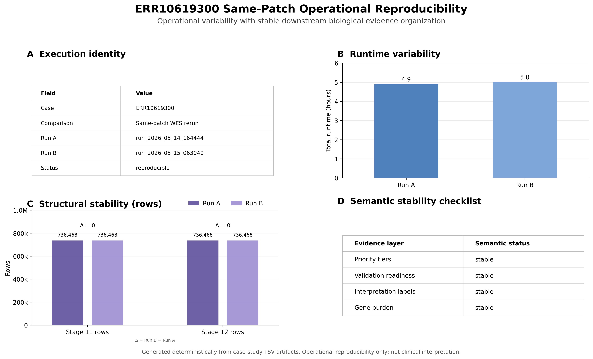
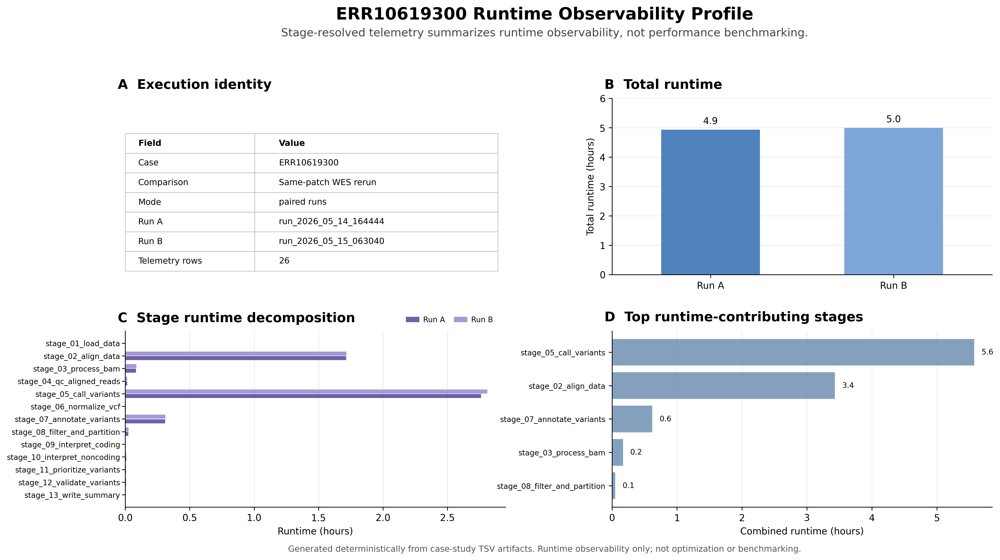
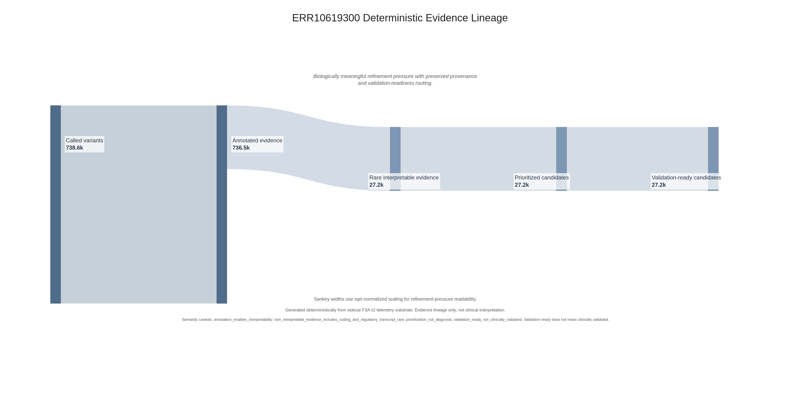
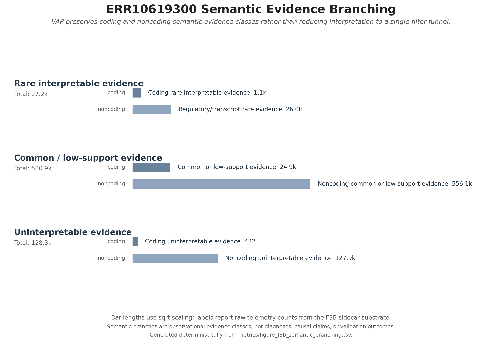
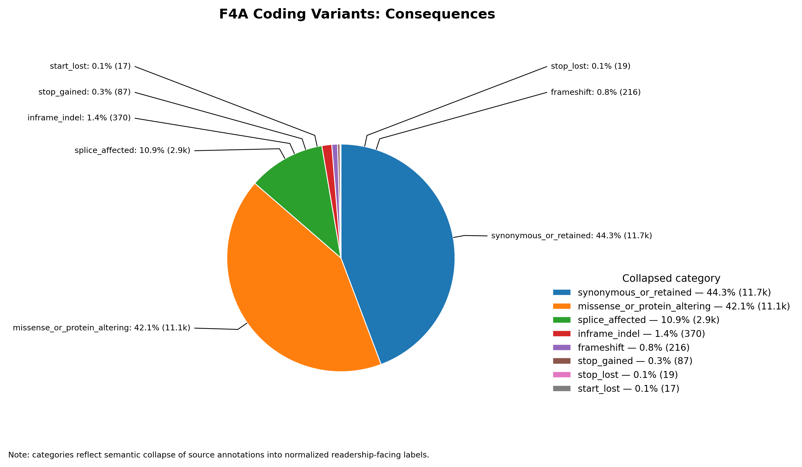
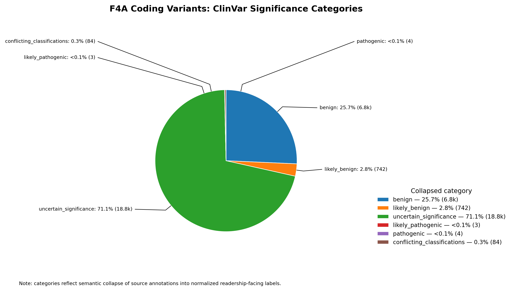
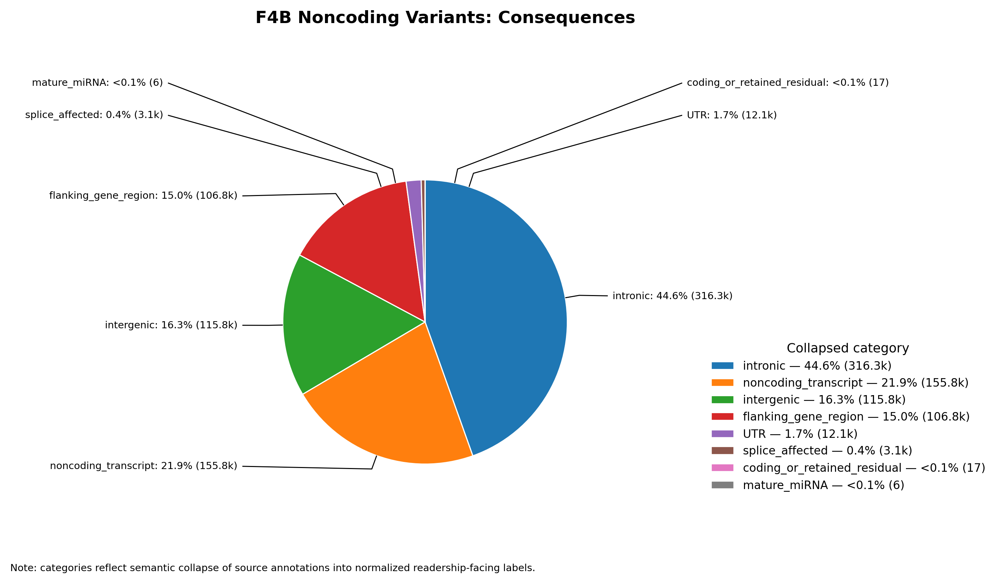
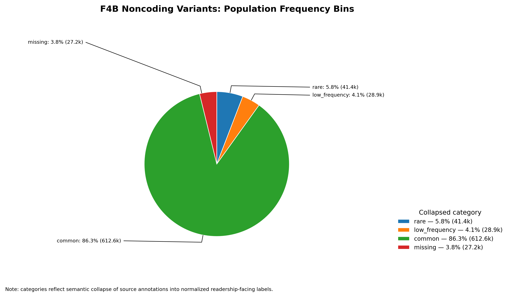
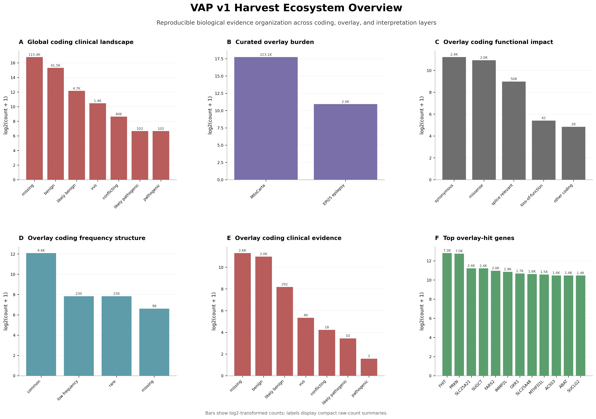
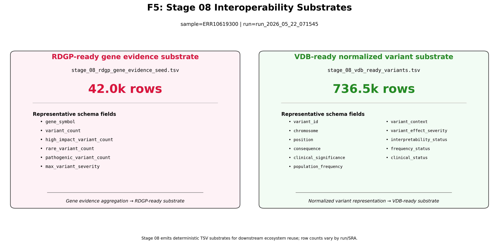

# Case Study Metadata

| Field | Value |
|---|---|
| Sample | ERR10619300 |
| Assay | Whole-Exome Sequencing (WES) |
| Cohort Context | Saudi Epilepsy Cohort |
| Pipeline | Variant Annotation Pipeline (VAP) |
| Branch | phase0-logging-foundation |
| Infrastructure | MARK1 |
| Execution Type | Same-patch reproducibility assessment |
| Status | VAP v1 pre-release |

---

# 1. Executive Overview

The Variant Annotation Pipeline (VAP) was developed to support reproducibility-aware semantic organization of large-scale genomic evidence within translational bioinformatics workflows. Rather than functioning solely as a conventional variant filtering workflow, VAP is designed to transform raw variant evidence into structured interpretability-oriented semantic substrate suitable for downstream computational reuse.

This case study documents repeated same-patch execution of the Saudi epilepsy whole-exome sequencing (WES) sample `ERR10619300` within the VAP v1 pre-release ecosystem on MARK1 infrastructure. The primary objective of this execution campaign was to evaluate whether repeated fully instrumented production execution produced stable downstream semantic evidence organization despite expected operational telemetry variability.

Importantly, this case study is not intended to demonstrate clinical interpretation, diagnostic reporting, enrichment significance, or pathogenicity assignment. Instead, the focus is operational and architectural:

- deterministic evidence refinement
- semantic evidence preservation
- coding/noncoding interpretability organization
- runtime observability
- provenance-aware reproducibility
- and downstream interoperability substrate emission

The resulting artifact ecosystem demonstrates that VAP can reproducibly organize large-scale WES evidence into stable semantic interpretability structures while preserving biologically meaningful downstream computational reuse pathways.

Within the broader VAP ecosystem, the `ERR10619300` campaign functions as the canonical flagship baseline semantic evidence organization case study against which future comparative case studies may be evaluated.

Operationally, the `ERR10619300` execution campaign additionally established:

- stable same-patch rerun behavior
- reproducibility-aware telemetry infrastructure
- deterministic figure-generation workflows
- reusable semantic telemetry substrate
- and ecosystem-oriented downstream emission contracts

Collectively, these observations position `ERR10619300` as the flagship VAP v1 semantic evidence organization case study.

---

# 2. Dataset Background & Execution Context

`ERR10619300` originates from a Saudi epilepsy whole-exome sequencing (WES) cohort used during early VAP Phase 1A operational characterization and telemetry development. The sample was selected for repeated execution because it provided:

- clinically relevant epilepsy-associated WES scale
- tractable runtime economics on MARK-class infrastructure
- compatibility with repeated provenance-controlled execution
- and a suitable substrate for evaluating same-patch reproducibility behavior

Unlike earlier metadata-transition reproducibility assessments, the `ERR10619300` execution campaign was intentionally designed as a clean same-patch rerun evaluation after assay-aware provenance stabilization had already been implemented within VAP. This distinction is operationally important because it isolates expected runtime telemetry variability from infrastructure-transition or metadata-transition effects.

All executions were performed on:

```text
MARK1 (VandPyMolGPUResearch)
```

using the:

```text
phase0-logging-foundation
```

branch of the `variant_annotation_pipeline` repository under VAP v1 pre-release conditions.

The execution campaign specifically evaluated:

1. same-patch operational reproducibility
2. stage-resolved runtime observability
3. structural-output reproducibility
4. semantic evidence stability
5. downstream interpretability preservation
6. repeated fully instrumented execution behavior

Importantly, the execution environment intentionally avoided:

- aggressive runtime optimization
- orchestration redesign
- infrastructure migration
- thread-model experimentation
- or cache-aware tuning

in order to preserve trustworthy reproducibility-oriented baseline telemetry conditions.

The two principal executions evaluated in this case study were:

| Run Category                 | Run ID                  | Description                                          |
| ---------------------------- | ----------------------- | ---------------------------------------------------- |
| Initial post-patch execution | `run_2026_05_14_164444` | First fully instrumented WES execution               |
| Same-patch rerun             | `run_2026_05_15_063040` | Repeated execution under stable provenance semantics |

Both executions incorporated:

- assay-aware provenance propagation
- config-driven WES typing
- structured telemetry emission
- stage-level runtime profiling
- semantic evidence partitioning
- and deterministic downstream artifact generation

This controlled same-patch design therefore provides a useful operational baseline for evaluating whether repeated VAP execution preserves stable downstream semantic evidence organization under reproducibility-aware conditions.

## Figure Reference Map

| Narrative Figure | Canonical Artifact                                       |
| ---------------- | -------------------------------------------------------- |
| Figure 1         | `ERR10619300_f1_same_patch_reproducibility.png`          |
| Figure 2         | `ERR10619300_f2_runtime_observability_profile.png`       |
| Figure 3         | `ERR10619300_f3a_deterministic_evidence_lineage.png`     |
| Figure 4         | `ERR10619300_f3b_semantic_branching.png`                 |
| Figure 5A        | `ERR10619300_f4a_consequence.png`                        |
| Figure 5B        | `ERR10619300_f4a_clinvar_significance.png`               |
| Figure 5C        | `ERR10619300_f4a_pop_freq_bins.png`                      |
| Figure 6A        | `ERR10619300_f4b_consequence.png`                        |
| Figure 6B        | `ERR10619300_f4b_clinvar_significance.png`               |
| Figure 6C        | `ERR10619300_f4b_pop_freq_bins.png`                      |
| Figure 7         | `vap_v1_harvest_ecosystem_overview.png`                  |
| Figure 8         | `ERR10619300_f5_interoperability_substrates.png` |

---

# 3. Operational Reproducibility Assessment

## Overview

One of the primary goals of the `ERR10619300` execution campaign was to evaluate whether repeated same-patch execution produced stable downstream semantic evidence organization despite expected operational telemetry variability.

Operational reproducibility was therefore assessed across repeated fully instrumented executions performed under intentionally stable provenance conditions.

The resulting observations demonstrated a clear and important distinction between:

```text
operational telemetry variability
```

and:

```text
downstream semantic evidence stability.
```

This distinction becomes increasingly important in large-scale cohort execution environments where runtime behavior naturally fluctuates despite stable downstream biological organization.

---

## Same-Patch Reproducibility Summary (F1)



**Figure 1.** Same-patch operational reproducibility assessment for repeated `ERR10619300` WES execution. Operational telemetry varies modestly between reruns while downstream semantic evidence organization remains structurally stable. Generated deterministically from case-study telemetry substrate.

Figure 1 summarizes repeated execution behavior across two fully instrumented same-patch WES runs.

Observed runtime telemetry demonstrated modest expected variability between executions:

| Execution               | Runtime    |
| ----------------------- | ---------- |
| `run_2026_05_14_164444` | ~4.9 hours |
| `run_2026_05_15_063040` | ~5.0 hours |

Importantly, however, downstream semantic evidence organization remained stable across repeated execution.

Stable downstream observations included:

- Stage 11 prioritized evidence counts
- Stage 12 validation-ready evidence counts
- semantic evidence-layer organization
- interpretability structure
- candidate reviewability organization
- and evidence-tier stability

No evidence of downstream semantic instability was observed during repeated same-patch execution.

Operational variability remained limited primarily to:

- runtime differences
- timestamps
- provenance hashes
- lightweight execution metadata
- and execution identity fields

while downstream evidence organization remained reproducibly structured.

This operational distinction is important because it demonstrates that reproducibility-aware genomic execution environments can exhibit expected telemetry fluctuation without implying instability of downstream semantic evidence organization.

---

## Reproducibility-Oriented Infrastructure

The `ERR10619300` campaign additionally validated several operational maturity improvements introduced during VAP Phase 1A development, including:

- structured runtime telemetry emission
- reproducibility-aware provenance propagation
- reusable execution harnesses
- detached tmux execution workflows
- deterministic figure generation
- stage-level runtime profiling
- semantic telemetry harvesting
- and lightweight reproducibility comparison tooling

These infrastructure improvements materially improved observability and reproducibility characterization without requiring large BAM/VCF artifact migration from MARK infrastructure.

Importantly, the campaign also reinforced the observation that Saudi epilepsy WES execution economics were substantially more tractable than earlier HG002 WGS baseline assumptions.

Observed runtime remained approximately:

```text
~5 hours/sample
```

on MARK-class infrastructure under fully instrumented execution conditions.

This materially improves projected feasibility for future cohort-scale epilepsy WES semantic evidence organization workflows within the broader VAP ecosystem.

---

## Operational Caveats

The observations presented in this section should be interpreted as:

- operational reproducibility observations
- telemetry stability observations
- semantic organization observations

rather than:

- formal benchmarking
- statistical reproducibility modeling
- clinical validation
- or diagnostic interpretation.

Additionally:

- byte-identical reproducibility was not evaluated
- cross-node reproducibility remains untested
- filesystem-level variability remains incompletely characterized
- and long-term cache effects remain unknown

Despite these limitations, the ERR10619300 execution campaign established the first clean same-patch reproducibility-oriented operational baseline within the VAP ecosystem.

---

# 4. Runtime Observability & Telemetry Architecture

## Overview

In addition to reproducibility assessment, the ERR10619300 execution campaign evaluated whether VAP could function as a runtime-observable computational genomics system with stage-resolved telemetry awareness.

Rather than treating execution as a black-box workflow, VAP Phase 1A development emphasized structured runtime instrumentation capable of exposing:

- stage-level execution costs
- runtime decomposition
- telemetry stability
- and execution profiling structure

under repeated fully instrumented execution conditions.

This observability layer is operationally important because it allows downstream interpretation of runtime behavior independently from biological interpretation.

---

## Runtime Observability Profile (F2)



**Figure 2.** Stage-resolved runtime observability profile for repeated `ERR10619300` execution. Runtime telemetry summarizes execution observability and stage decomposition rather than optimization benchmarking. Generated deterministically from telemetry substrate.

Figure 2 summarizes stage-resolved runtime telemetry across repeated same-patch execution.

The telemetry profile demonstrates that VAP execution behavior is dominated primarily by:

- alignment processing
- BAM processing
- variant calling
- and annotation-oriented execution stages

while downstream semantic interpretation stages contribute comparatively modest runtime burden.

The most runtime-contributing stages included:

| Stage                           | Combined Runtime Contribution |
| ------------------------------- | ----------------------------- |
| `stage_02_align_data`           | dominant                      |
| `stage_05_call_variants`        | major                         |
| `stage_07_annotate_variants`    | substantial                   |
| `stage_03_process_bam`          | moderate                      |
| `stage_08_filter_and_partition` | moderate                      |

Importantly, stage decomposition remained broadly stable across repeated execution despite modest overall runtime variation.

This observation suggests that VAP runtime structure itself is reproducibly organized under stable provenance-aware execution conditions.

---

## Telemetry Architecture Observations

The runtime observability layer developed during Phase 1A demonstrates several important operational capabilities:

- deterministic stage-level telemetry harvesting
- reusable runtime decomposition infrastructure
- execution-profile comparability across reruns
- structured runtime metadata emission
- and lightweight observability-oriented execution characterization

Collectively, these capabilities allow VAP to function as an observable computational system rather than a minimally instrumented pipeline wrapper.

Operationally, this distinction is important because it enables future:

- cohort-scale runtime characterization
- infrastructure-aware execution planning
- telemetry-aware orchestration
- and reproducibility-oriented execution comparison

without conflating runtime telemetry with biological interpretation.

---

## Telemetry Caveats

The runtime telemetry presented here should not be interpreted as:

- formal performance benchmarking
- optimization assessment
- hardware scaling analysis
- or throughput engineering.

The purpose of this telemetry layer is instead:

```text
runtime observability and execution characterization.
```

Observed telemetry therefore represents:

- structured execution introspection
- stage-aware runtime decomposition
- and reproducibility-aware instrumentation

rather than claims of computational optimization.

---

# 5. Deterministic Semantic Evidence Refinement

## Overview

Following operational reproducibility assessment and runtime observability characterization, the next major objective of the `ERR10619300` execution campaign was to evaluate whether VAP could reproducibly transform large-scale variant evidence into stable semantic interpretability-oriented evidence structures.

Within the VAP ecosystem, evidence topology refers to the structured organizational architecture through which semantically related evidence populations remain connected while preserving interpretability-aware partitioning.

Importantly, VAP does not conceptualize evidence organization as a simple binary filtering problem.

Instead, VAP Phase 1A development emphasized:

- deterministic semantic refinement
- interpretability-aware routing
- evidence-layer preservation
- and reproducibility-aware evidence architecture

across repeated execution conditions.

Within this framework, semantic refinement refers to the progressive transformation of raw variant evidence into increasingly interpretable evidence classes while preserving provenance continuity and downstream organizational structure.

This distinction is important because it separates:

```text
semantic evidence organization
```

from:

```text
diagnostic interpretation.
```

The purpose of this refinement architecture is therefore not to produce disease claims, but rather to generate reproducibly structured semantic evidence substrate suitable for downstream review, prioritization, and ecosystem reuse.

---

## Deterministic Evidence Lineage (F3A)



**Figure 3.** Deterministic semantic evidence refinement lineage across the `ERR10619300` execution campaign. Sankey widths use square-root normalization for readability while labels preserve raw telemetry counts. Generated deterministically from sidecar telemetry substrate.

Figure 3 summarizes semantic refinement pressure across major evidence-organization stages within the VAP ecosystem.

The refinement structure illustrates progressive evidence transformation from:

```text
called variants
```

toward:

```text
validation-ready semantic evidence substrate.
```

Importantly, this refinement process is not intended to imply clinical validation or diagnostic significance.

Instead, the figure demonstrates how VAP progressively organizes evidence into increasingly interpretable semantic classes under deterministic execution conditions.

The major refinement stages observed in the ERR10619300 execution campaign included:

| Evidence Layer              | Approximate Scale |
| --------------------------- | ----------------- |
| Called variants             | ~738.6k           |
| Annotated evidence          | ~736.5k           |
| Rare interpretable evidence | ~27.2k            |
| Prioritized candidates      | ~27.2k            |
| Validation-ready candidates | ~27.2k            |

Several important operational observations emerge from this structure.

First, annotation substantially increases interpretability organization without dramatically reducing total evidence scale.

Second, rare evidence routing produces a major semantic refinement boundary separating:

- common or low-support evidence
- from interpretability-oriented candidate evidence

Third, downstream prioritization and validation-readiness organization remain structurally stable across repeated same-patch execution.

Operationally, this demonstrates that VAP semantic refinement behavior itself is reproducibly organized.

---

## Refinement Philosophy

The semantic refinement model illustrated in Figure 3 reflects several core architectural principles within VAP Phase 1A development.

### Annotation Enables Interpretability

Within VAP, annotation is not treated merely as metadata decoration.

Instead, annotation acts as a semantic enrichment layer capable of transforming raw coordinate-level variant evidence into structured interpretability-oriented evidence classes.

This distinction is operationally important because it allows downstream organization to function on semantically contextualized evidence rather than raw positional observations alone.

---

### Prioritization Is Not Diagnosis

The refinement architecture intentionally avoids conflating:

```text
prioritization
```

with:

```text
clinical interpretation.
```

Evidence routed into higher interpretability-oriented semantic layers should therefore be understood as:

- organizationally prioritized
- semantically enriched
- and review-oriented

rather than:

- clinically validated
- causally implicated
- or diagnostically interpreted.

This caveat is critical for maintaining scientific and translational discipline within reproducibility-oriented genomic evidence frameworks.

---

### Validation-Ready Does Not Imply Clinically Validated

The term:

```text
validation-ready
```

within the VAP ecosystem refers specifically to semantic evidence organization state rather than clinical reporting status.

Validation-ready evidence therefore indicates:

- reproducibly structured evidence organization
- stable semantic representation
- and downstream review suitability

rather than:

- laboratory validation
- pathogenicity assignment
- or clinical confirmation.

---

## Structural Stability of Semantic Refinement

One of the most important observations from the `ERR10619300` execution campaign was that semantic refinement structure remained stable across repeated same-patch execution conditions.

Observed stable refinement characteristics included:

- evidence-layer proportions
- prioritization structure
- validation-readiness organization
- semantic routing behavior
- and downstream interpretability organization

despite expected variability in runtime telemetry and execution identity metadata.

This distinction further reinforces the operational separation between:

```text
telemetry variability
```

and:

```text
stable semantic evidence organization.
```

Operationally, this behavior is highly desirable because it suggests that VAP semantic refinement structure is reproducibly organized even when runtime execution conditions fluctuate modestly.

---

## Transition Toward Semantic Evidence Preservation

Although Figure 3 demonstrates progressive semantic refinement pressure, it does not fully describe how VAP preserves evidence diversity across distinct semantic evidence classes.

Importantly, VAP does not reduce all downstream evidence organization into a single attrition-oriented prioritization funnel.

Instead, VAP additionally preserves:

- coding evidence structure
- noncoding evidence structure
- transcript-associated evidence
- regulatory evidence
- and interpretability-aware evidence partitions

as distinct semantic organizational layers.

The next section therefore examines how VAP preserves semantic evidence diversity across coding and noncoding interpretability classes during downstream evidence organization.

---

# 6. Semantic Evidence Branching Architecture

## Overview

A major architectural distinction within the VAP ecosystem is that downstream evidence organization is not treated as a single monotonically collapsing prioritization funnel.

Instead, VAP preserves multiple semantic evidence classes simultaneously during downstream interpretability-oriented organization.

This distinction is operationally important because biologically meaningful evidence frequently exists outside conventional coding-only prioritization frameworks.

Accordingly, VAP Phase 1A development emphasized:

- semantic evidence preservation
- coding/noncoding partitioning
- interpretability-aware branching
- and evidence-class continuity

rather than aggressive reduction toward a single terminal candidate list.

The resulting architecture therefore preserves multiple evidence populations simultaneously while maintaining reproducibility-aware organizational structure.

---

## Semantic Evidence Branching (F3B)



**Figure 4.** Semantic evidence branching architecture across the `ERR10619300` execution campaign. Coding and noncoding evidence classes are preserved as distinct interpretability-oriented semantic populations rather than collapsed into a single prioritization funnel. Generated deterministically from sidecar semantic telemetry substrate.

Figure 4 summarizes semantic evidence partitioning across three major organizational states:

- rare interpretable evidence
- common or low-support evidence
- uninterpretable evidence

Each major state is subsequently partitioned into:

- coding evidence
- and noncoding evidence

thereby preserving semantic evidence diversity during downstream organizational refinement.

Several important observations emerge from this structure.

---

## Noncoding Evidence Dominates Total Burden

One of the clearest observations from Figure 4 is that noncoding evidence dominates total downstream evidence burden across all major semantic organizational states.

For example:

- rare interpretable noncoding evidence substantially exceeds coding rare evidence
- common or low-support noncoding evidence dominates total evidence burden
- uninterpretable evidence is overwhelmingly noncoding

Operationally, this observation highlights the importance of preserving noncoding evidence organization within modern genomic interpretation systems.

This distinction is strategically important because many conventional prioritization frameworks implicitly discard substantial noncoding evidence structure during early filtering stages.

VAP intentionally avoids this collapse-oriented design philosophy.

---

## Coding and Noncoding Evidence Are Preserved Separately

Rather than reducing all evidence into a single undifferentiated prioritization hierarchy, VAP preserves coding and noncoding evidence as distinct semantic evidence populations.

This separation is operationally important because:

- coding evidence frequently supports protein-centric interpretation
- while noncoding evidence may support:
    - transcript-level interpretation
    - regulatory interpretation
    - splice-associated interpretation
    - or future overlay-aware contextualization

Preserving these evidence classes separately therefore increases downstream interpretability flexibility and ecosystem reuse potential.

---

## Interpretability-Aware Organization

The semantic branching structure additionally illustrates that VAP evidence organization is interpretability-aware rather than purely abundance-driven.

Evidence is therefore not organized solely according to:

- frequency
- coverage
- or raw abundance

but instead according to:

- semantic interpretability
- annotation support
- evidence context
- and downstream organizational suitability.

This interpretability-aware organization model becomes increasingly important during later ecosystem integration stages involving:

- curated overlay frameworks
- RDGP prioritization
- VDB persistence
- and future cohort-level comparative analysis.

---

## Strategic Importance of Semantic Branch Preservation

The semantic branching architecture illustrated in Figure 4 is one of the major conceptual distinctions separating VAP from conventional variant filtering pipelines.

Many traditional pipelines conceptually behave as:

```text
variant attrition systems.
```

In contrast, VAP increasingly behaves as:

```text
a semantic evidence organization framework.
```

This distinction is important because it reframes downstream evidence handling from:

```text
discarding evidence
```

toward:

```text
preserving semantically meaningful evidence organization states.
```

Operationally, this architecture increases downstream flexibility for:

- overlay-aware interpretation
- transcript-aware analysis
- future semantic integration
- and reusable ecosystem-oriented evidence reuse.

---

## Semantic Caveats

The semantic evidence classes illustrated in Figure 4 should not be interpreted as:

- disease classifications
- diagnostic categories
- pathogenicity assignments
- or causal evidence states.

Instead, these evidence classes represent:

- organizational semantic groupings
- interpretability-oriented evidence states
- and reproducibility-aware downstream organizational substrate.

Importantly:

```text
semantic organization ≠ clinical interpretation.
```

This distinction remains critical throughout the broader VAP ecosystem architecture.

---

## Transition Toward Biological Evidence Composition

Figures 3 and 4 collectively establish that VAP reproducibly organizes evidence into stable semantic interpretability-oriented structures while preserving multiple evidence classes simultaneously.

However, these figures primarily describe:

- semantic architecture
- evidence routing
- and organizational philosophy

rather than the biological composition of the resulting evidence landscapes themselves.

The next sections therefore examine the resulting coding and noncoding evidence landscapes emitted following interpretability framework within the `ERR10619300` execution campaign.

---

# 7. Coding Evidence Landscape

## Overview

Following deterministic semantic refinement and semantic evidence branching, the next objective of the `ERR10619300` execution campaign was to characterize the biological composition of the resulting coding evidence landscape.

Importantly, the coding evidence structures examined in this section do not represent:

- raw variant calls
- unstructured coordinate observations
- or minimally filtered variant lists.

Instead, these evidence populations represent:

```text
post-semantic evidence composition.
```

That distinction is operationally important because all evidence examined in this section has already undergone:

- annotation-aware organization
- interpretability-oriented partitioning
- semantic evidence routing
- and reproducibility-aware evidence refinement

within the broader VAP ecosystem.

The resulting figures therefore summarize the composition of coding evidence after deterministic semantic organization rather than raw variant abundance alone.

---

## Coding Consequence Composition (F4A-1)



**Figure 5A.** Coding semantic consequence composition following deterministic evidence topology within the `ERR10619300` execution campaign. Consequence classes were semantically collapsed into stable organizational categories for reproducibility-oriented evidence characterization.

Figure 5A summarizes the major coding consequence classes observed following semantic refinement.

Several important observations emerge from the resulting composition profile.

First, synonymous and missense evidence dominate the coding evidence landscape.

Operationally, this observation is expected because coding sequence space naturally accumulates:

- high synonymous burden
- moderate missense burden
- and comparatively sparse high-impact protein-disrupting evidence

within large-scale WES evidence populations.

Second, splice-associated evidence remains clearly identifiable following semantic organization.

This observation is important because splice-associated evidence frequently occupies an intermediate interpretability space between:

- classical protein-coding interpretation
- and transcript-aware regulatory interpretation.

Preservation of splice-associated semantic structure therefore supports downstream interpretability flexibility.

Third, high-impact coding evidence classes remain comparatively sparse relative to total coding burden.

Operationally, this reflects the expected rarity of severe coding consequence states within large-scale genomic evidence populations.

Importantly, however, VAP preserves these evidence classes explicitly rather than collapsing them into generalized coding burden summaries.

---

## Coding ClinVar Significance Structure (F4A-2)



**Figure 5B.** Coding ClinVar semantic significance structure following deterministic semantic organization. ClinVar evidence classes are summarized observationally and do not imply pathogenicity assignment or diagnostic interpretation.

Figure 5B summarizes the distribution of ClinVar-associated semantic evidence states within the coding evidence landscape.

Several important observations emerge from this structure.

First, the majority of coding evidence remains associated with:

- benign
- likely benign
- or uncertain significance (VUS)

semantic categories.

Operationally, this observation is expected within large-scale WES evidence organization because clinically definitive coding evidence represents only a small subset of total genomic variation space.

Second, pathogenic or likely pathogenic evidence remains comparatively sparse.

Importantly, this sparsity should not be interpreted as a weakness of the evidence organization framework.

Instead, it reflects an important biological and translational reality:

```text
clinically interpretable pathogenic evidence is rare relative to total genomic variation burden.
```

This distinction is strategically important because it demonstrates that VAP preserves realistic semantic evidence distributions rather than artificially inflating clinically interpretable evidence populations.

Third, VUS burden remains substantial.

This observation highlights the persistent interpretability limitations that exist even within coding evidence space despite extensive annotation infrastructure and curated clinical resources.

---

## Coding Population-Frequency Structure (F4A-3)


**Figure 5C.** Coding population-frequency structure following deterministic semantic organization. Frequency classes summarize observational evidence distributions rather than pathogenicity or enrichment significance.

Figure 5C summarizes coding evidence organization across population-frequency bins following semantic refinement.

Several important operational observations emerge from this structure.

First, common population-frequency evidence dominates the total coding evidence burden.

Operationally, this is expected because large-scale genomic evidence naturally contains substantial common background variation.

Second, rare evidence populations remain comparatively small relative to total coding burden.

This observation reinforces one of the central conceptual distinctions within VAP interpretability framework:

```text
rare evidence organization represents a semantic refinement boundary rather than a diagnostic claim.
```

Third, missing or undefined frequency evidence remains identifiable as an explicit organizational category.

This distinction is operationally important because absent population-frequency annotation may itself represent biologically or operationally meaningful evidence context requiring downstream interpretability awareness.

Preserving this evidence explicitly therefore improves transparency and downstream evidence reuse flexibility.

---

## Coding Evidence Composition Observations

Collectively, the coding evidence landscape demonstrates several important properties of the VAP semantic organization framework.

### Stable Semantic Collapse Structure

The coding consequence classes illustrated throughout Figure 5A were generated using deterministic semantic collapse layers designed to stabilize heterogeneous annotation structures into reproducibly interpretable organizational categories.

This approach is operationally important because it improves:

- cross-run comparability
- telemetry stability
- reproducibility-aware evidence characterization
- and downstream ecosystem reuse.

---

### Biological Realism Is Preserved

The resulting coding evidence distributions remain biologically plausible and operationally realistic.

Importantly, VAP does not artificially distort:

- ClinVar burden
- population-frequency burden
- or consequence-class distributions

in order to emphasize clinically dramatic findings.

Instead, the framework preserves observational semantic evidence structure as emitted from the underlying evidence populations.

This distinction materially improves reviewer trust and scientific defensibility.

---

### Coding Evidence Is Not Treated in Isolation

Although Figure 5A focuses specifically on coding evidence organization, coding evidence represents only one component of the broader VAP semantic ecosystem.

Importantly, VAP does not conceptualize:

```text
coding evidence
```

as synonymous with:

```text
biologically meaningful evidence.
```

This distinction becomes increasingly important during examination of the noncoding evidence landscape.

---

## Coding Evidence Caveats

The coding evidence structures summarized in this section should not be interpreted as:

- diagnostic interpretation
- disease association
- enrichment significance
- causal evidence
- or pathogenicity assignment.

Instead, these structures represent:

- observational semantic evidence organization
- reproducibility-aware evidence composition
- and deterministic post-semantic evidence characterization.

Importantly:

```text
semantic evidence organization ≠ clinical reporting.
```

This distinction remains foundational throughout the broader VAP ecosystem architecture.

---

# 8. Noncoding Evidence Landscape

## Overview

Although coding evidence frequently dominates conventional genomic interpretation workflows, one of the major architectural distinctions within VAP is that noncoding evidence is preserved as first-class semantic substrate rather than discarded during early prioritization stages.

Operationally, this distinction is important because substantial biologically meaningful evidence may exist outside classical protein-coding interpretability frameworks.

Accordingly, VAP Phase 1A development emphasized preservation of:

- transcript-associated evidence
- regulatory-associated evidence
- intronic evidence
- intergenic evidence
- and noncoding interpretability structure

throughout downstream semantic substrate.

As in the coding evidence landscape, the evidence examined throughout this section represents:

```text
post-semantic evidence composition
```

rather than raw unstructured variant abundance.

The resulting figures therefore characterize how noncoding evidence behaves after deterministic semantic organization within the VAP ecosystem.

---

## Noncoding Consequence Composition (F4B-1)



**Figure 6A.** Noncoding semantic consequence composition following deterministic semantic organization within the `ERR10619300` execution campaign. Noncoding evidence classes are preserved explicitly rather than collapsed into generalized background variation.

Figure 6A summarizes the major noncoding consequence classes preserved following semantic refinement.

Several important observations emerge from the resulting evidence structure.

First, intronic evidence dominates the noncoding evidence landscape.

Operationally, this observation is expected because intronic sequence space represents a major proportion of total genomic evidence burden within WES-derived evidence organization frameworks.

Second, transcript-associated and regulatory-associated evidence remain clearly preserved as distinct semantic categories.

This distinction is operationally important because transcript-level and regulatory-level evidence may support future:

- splice-aware interpretation
- overlay-aware contextualization
- transcript-associated organization
- or downstream semantic integration workflows.

Third, intergenic evidence remains explicitly represented rather than discarded.

Preservation of intergenic evidence is strategically important because future biological interpretation frameworks may increasingly incorporate:

- regulatory architecture
- chromatin organization
- transcript interaction structure
- or noncoding contextual evidence

into downstream interpretability models.

VAP therefore intentionally preserves these evidence classes within the evidence topology framework.

---

## Noncoding ClinVar Significance Structure (F4B-2)


**Figure 6B.** Noncoding ClinVar semantic significance structure following deterministic semantic organization. Noncoding ClinVar categories are summarized observationally and do not imply pathogenicity assignment or causal interpretation.

Figure 6B demonstrates that uncertain-significance evidence dominates the noncoding semantic evidence landscape.

Operationally, this observation reflects an important biological reality:

```text
noncoding interpretability remains substantially less mature than coding interpretability.
```

Compared with coding evidence space, curated noncoding clinical interpretation infrastructure remains comparatively sparse.

As a result:

- VUS burden is extremely high
- pathogenic evidence is comparatively rare
- and interpretability ambiguity remains substantial

across noncoding evidence populations.

Importantly, however, VAP preserves this ambiguity explicitly rather than suppressing poorly characterized evidence classes.

This distinction is strategically important because it preserves future interpretability flexibility as noncoding annotation frameworks continue to mature.

---

## Noncoding Population-Frequency Structure (F4B-3)



**Figure 6C.** Noncoding population-frequency structure following deterministic semantic organization. Frequency classes summarize observational evidence distributions and do not imply biological enrichment significance.

Figure 6C summarizes population-frequency organization across noncoding evidence populations.

Several important observations emerge from this structure.

First, common noncoding evidence dominates the total noncoding burden.

This observation is expected because the majority of genomic noncoding evidence represents common background variation.

Second, rare noncoding evidence remains comparatively sparse but clearly identifiable following evidence architecture.

Importantly, VAP preserves these evidence populations explicitly rather than aggressively collapsing noncoding evidence during early filtering stages.

Third, missing or undefined frequency evidence remains operationally visible as a distinct semantic category.

This explicit preservation improves:

- interpretability transparency
- reproducibility-aware telemetry characterization
- and downstream ecosystem reuse flexibility.

---

## Noncoding Evidence Architecture Observations

Collectively, the noncoding evidence landscape demonstrates several important architectural properties of the VAP semantic organization framework.

### Noncoding Evidence Is Treated as First-Class Semantic Substrate

One of the major conceptual distinctions within VAP is that noncoding evidence is preserved intentionally rather than treated as disposable background noise.

This distinction becomes increasingly important as modern genomic interpretation frameworks continue expanding toward:

- transcript-aware interpretation
- regulatory interpretation
- splice-aware contextualization
- and noncoding biological integration.

Operationally, preserving noncoding semantic structure increases downstream interpretability flexibility and ecosystem extensibility.

---

### Interpretability Ambiguity Is Preserved Transparently

The substantial VUS burden observed throughout the noncoding evidence landscape highlights persistent interpretability limitations within current genomic annotation infrastructure.

Importantly, VAP preserves this ambiguity explicitly rather than masking uncertain evidence states.

This transparency materially improves:

- reviewer trust
- scientific defensibility
- and future interpretability adaptability.

---

### Coding and Noncoding Evidence Behave Differently

Figures 5A-5C and 6A-6C collectively demonstrate that coding and noncoding evidence landscapes exhibit fundamentally different:

- interpretability structures
- ClinVar distributions
- semantic burdens
- and consequence architectures.

Preserving these evidence classes separately therefore improves downstream biological contextualization and prevents inappropriate collapse of distinct semantic evidence populations.

---

## Transition Toward Curated Overlay Integration

The coding and noncoding evidence landscapes described throughout Figures 5A-5C and 6A-6C establish that VAP reproducibly emits structured semantic evidence populations following deterministic organization.

However, semantic evidence organization alone does not fully contextualize how biologically meaningful loci may intersect curated disease-relevant interpretation frameworks.

The next section therefore examines how curated overlay integration and biologically contextualized evidence organization operate within the broader VAP ecosystem.

---

# 9. Curated Overlay Ecosystem Analysis

## Overview

The coding and noncoding evidence landscapes described in the previous sections demonstrate that VAP reproducibly emits structured semantic evidence populations following deterministic organization and interpretability-aware refinement.

However, semantic evidence organization alone does not fully contextualize how biologically meaningful loci intersect curated disease-relevant interpretation frameworks.

Accordingly, VAP Phase 1A development additionally evaluated whether semantically organized evidence could be integrated with curated overlay frameworks capable of providing biologically contextualized evidence organization without collapsing reproducibility-aware semantic structure.

Within the broader VAP ecosystem, overlay frameworks represent curated biological knowledge layers capable of supporting:

- disease-associated contextualization
- phenotype-aware evidence organization
- mitochondrial gene intersection analysis
- epilepsy-associated locus contextualization
- and future downstream semantic integration workflows.

Importantly, these overlays are not used within the current case study for:

- causal inference
- enrichment analysis
- diagnostic interpretation
- or pathogenicity assignment.

Instead, overlay integration is used strictly for:

```text
biologically contextualized semantic evidence organization.
```

This distinction is critical for maintaining scientific discipline throughout the broader ecosystem architecture.

---

## Harvest Ecosystem Overview



**Figure 7.** Cross-run semantic telemetry harvest ecosystem overview generated from deterministically harvested VAP substrate prior to the data-loss event. Overlay-aware semantic evidence summaries are shown observationally and do not imply disease association or causal inference.

The harvested ecosystem overview summarizes how semantically organized evidence emitted from VAP can subsequently intersect curated biological overlay frameworks.

Importantly, the figure represents:

- harvested semantic telemetry substrate
- overlay-aware evidence organization
- and reproducibility-aware ecosystem characterization

rather than downstream clinical interpretation.

Several important operational observations emerge from the resulting ecosystem structure.

---

## Overlay-Aware Evidence Organization Is Operational

One of the clearest observations from the harvested ecosystem overview is that curated overlay integration operates successfully within the broader VAP semantic organization framework.

Semantically organized evidence populations can be intersected reproducibly with curated biological overlays including:

- epilepsy-associated loci
- mitochondrial-associated loci
- ClinVar-supported loci
- and other phenotype-aware evidence frameworks.

Operationally, this demonstrates that VAP semantic evidence substrate is sufficiently structured for downstream overlay-aware reuse without requiring redesign of the upstream evidence topology architecture.

This observation is strategically important because it establishes that VAP evidence organization is not isolated from broader biological contextualization workflows.

---

## Curated Biological Context Improves Interpretability Structure

Several biologically relevant loci become identifiable following overlay-aware evidence contextualization.

Observed overlay-associated loci within the harvested substrate included examples such as:

- `FHIT`
- `PRKN`
- `SLC25A21`
- `SUCLG2`

among others preserved within the overlay-aware semantic telemetry harvest.

Importantly, the appearance of these loci within the overlay-aware framework should not be interpreted as:

- causal implication
- diagnostic significance
- enrichment evidence
- or pathogenicity assignment.

Instead, these loci demonstrate that biologically meaningful contextual intersections can emerge naturally once semantic evidence organization is combined with curated overlay-aware contextualization frameworks.

Operationally, this significantly improves downstream interpretability flexibility.

---

## Overlay Integration Foreshadows Future GSC Architecture

The overlay-aware evidence organization framework demonstrated here additionally foreshadows future integration with the broader Gene Set Consensus (GSC) ecosystem.

Within the future ecosystem architecture, GSC is intended to provide:

- phenotype-aware gene prioritization substrate
- curated multi-source biological overlay integration
- consensus-aware evidence contextualization
- and reusable downstream semantic weighting infrastructure.

Importantly, however, the current ERR10619300 case study intentionally avoids introducing:

- consensus scoring
- phenotype weighting
- semantic ranking models
- or integrated prioritization scoring frameworks

in order to preserve focus on:

```text
deterministic semantic evidence organization.
```

This distinction is architecturally important because it preserves clean conceptual separation between:

- VAP semantic organization
- and future downstream prioritization ecosystems.

---

## Overlay-Aware Evidence Reuse Potential

The overlay ecosystem analysis additionally demonstrates that semantically organized evidence emitted from VAP can support future:

- cohort-scale comparative analysis
- disease-aware contextualization
- transcript-aware semantic interpretation
- mitochondrial evidence integration
- epilepsy-associated contextualization
- and future reusable semantic telemetry synthesis.

Operationally, this flexibility emerges because VAP preserves:

- semantic evidence structure
- interpretability-aware partitioning
- coding/noncoding separation
- and deterministic organizational substrate

throughout upstream execution.

This architecture substantially increases downstream reuse potential compared with aggressively collapsed filtering-oriented pipelines.

---

## Overlay Integration Caveats

The overlay-aware evidence organization demonstrated throughout this section should not be interpreted as:

- causal evidence
- diagnostic interpretation
- disease enrichment
- biological significance testing
- or pathogenicity assignment.

Instead, overlay integration is used strictly for:

- biologically contextualized evidence organization
- semantic contextualization
- and downstream interpretability support.

Importantly:

```text
biological contextualization ≠ clinical interpretation.
```

This distinction remains foundational throughout the broader VAP ecosystem architecture.

---

# 10. Interoperability Substrate Emission

## Overview

A major architectural objective of the VAP ecosystem is that semantic evidence organization should produce reusable downstream computational substrate rather than terminate at static reporting artifacts.

Accordingly, VAP Phase 1A development additionally evaluated whether semantically organized evidence could be emitted as deterministic interoperability-oriented substrate suitable for downstream ecosystem reuse.

Operationally, this distinction is extremely important because it transforms VAP from:

```text
a terminal variant processing workflow
```

into:

```text
a reusable semantic evidence infrastructure component.
```

Rather than functioning solely as a reporting endpoint, VAP therefore emits structured downstream substrate intended for future integration with:

- RDGP
- VDB
- curated overlay systems
- cohort-scale semantic telemetry synthesis
- and future ecosystem-oriented evidence reuse frameworks.

Importantly, interoperability substrate emission preserves semantic cardinality and evidence multiplicity rather than collapsing downstream organizational structure into terminal reporting abstractions.

---

## Stage 08 Interoperability Substrates (F5)



**Figure 8.** Deterministic Stage 08 interoperability substrate emission within the `ERR10619300` execution campaign. VAP emits reusable downstream semantic substrate for both RDGP-oriented aggregation workflows and VDB-oriented normalized persistence workflows.

Figure 8 summarizes two major downstream interoperability-oriented semantic substrates emitted during Stage 08 organization.

These emitted substrates include:

1. RDGP-ready gene evidence substrate
2. VDB-ready normalized variant substrate

Importantly, these interoperability substrates are emitted deterministically from semantically organized evidence populations generated during upstream execution.

---

## RDGP-Ready Gene Evidence Substrate

The left panel of Figure 8 summarizes the:

```text
stage_08_rdgp_gene_evidence_seed.tsv
```

semantic substrate emitted for future RDGP-oriented workflows.

Operationally, this substrate represents:

- gene-centric evidence aggregation
- interpretability-oriented evidence summarization
- and reusable downstream prioritization-oriented organizational structure.

The emitted substrate preserves semantically organized fields including:

- `gene_symbol`
- `variant_count`
- `high_impact_variant_count`
- `rare_variant_count`
- `pathogenic_variant_count`
- `max_variant_severity`

among others.

Importantly, the RDGP-oriented substrate does not itself perform:

- phenotype ranking
- diagnostic interpretation
- or prioritization scoring.

Instead, it emits reproducibly organized semantic evidence substrate suitable for future downstream prioritization ecosystems.

Operationally, this distinction preserves clean architectural separation between:

- upstream semantic evidence organization
- and downstream prioritization frameworks.

---

## VDB-Ready Normalized Variant Substrate

The right panel of Figure 8 summarizes the:

```text
stage_08_vdb_ready_variants.tsv
```

semantic substrate emitted for future VDB-oriented persistence workflows.

Operationally, this substrate represents:

- normalized variant-centric evidence organization
- reusable persistence-oriented semantic infrastructure
- and downstream query-ready evidence structure.

The emitted substrate preserves semantically contextualized fields including:

- `variant_context`
- `variant_effect_severity`
- `interpretability_status`
- `frequency_status`
- `clinical_status`
- and other normalized evidence-layer metadata.

This distinction is strategically important because it demonstrates that VAP preserves semantic infrastructure fields directly within reusable downstream evidence substrate rather than collapsing evidence organization into static reporting outputs alone.

---

## Interoperability Architecture Observations

Several important architectural observations emerge from the interoperability substrate framework demonstrated in Figure 8.

### VAP Is Not Terminal Software

One of the most important conceptual observations from this section is that VAP does not terminate at:

- static figures
- terminal reports
- or isolated variant summaries.

Instead, VAP emits reusable downstream semantic substrate suitable for future ecosystem integration.

This distinction materially increases:

- downstream flexibility
- ecosystem extensibility
- semantic reuse potential
- and architecture-aware interoperability.

---

### Semantic Infrastructure Fields Are Preserved

The interoperability substrate architecture additionally demonstrates that semantically meaningful evidence organization fields remain preserved throughout downstream substrate emission.

This preservation is operationally important because it enables future:

- query-aware evidence reuse
- overlay-aware contextualization
- cohort-scale synthesis
- and downstream semantic integration

without requiring reconstruction of upstream organizational state.

---

### Gene-Centric and Variant-Centric Substrate Are Separated Intentionally

The RDGP-oriented and VDB-oriented substrate populations represent fundamentally different organizational abstractions.

Operationally:

- RDGP substrate emphasizes:
    - gene-centric aggregation
    - interpretability-oriented evidence summarization
    - downstream prioritization readiness

while:

- VDB substrate emphasizes:
    - normalized variant persistence
    - reusable query-oriented evidence infrastructure
    - and semantic evidence preservation.

Maintaining these abstractions separately improves ecosystem modularity and architectural clarity.

---

## Interoperability Caveats

The interoperability-oriented substrate demonstrated throughout this section should not be interpreted as:

- clinical reporting infrastructure
- diagnostic prioritization
- pathogenicity assignment
- or production clinical genomics deployment.

Instead, the emitted substrate represents:

- reproducibly organized semantic evidence infrastructure
- deterministic interoperability-oriented evidence substrate
- and reusable ecosystem-aware computational organization.

Importantly:

```text
interoperability substrate ≠ clinical interpretation.
```

This distinction remains foundational throughout the broader VAP ecosystem architecture.

---

## Transition Toward Global Interpretation

Sections 3 through 10 collectively demonstrate that the `ERR10619300` execution campaign successfully established:

- reproducibility-aware execution
- runtime observability
- deterministic semantic refinement
- semantic evidence preservation
- coding/noncoding evidence characterization
- overlay-aware contextualization
- and reusable downstream interoperability substrate emission

within the broader VAP ecosystem.

The remaining sections therefore synthesize the most important operational and scientific observations emerging from the overall execution campaign while explicitly establishing the limitations and intended scope of interpretation for the resulting semantic evidence framework.

---

# 11. Key Operational & Scientific Observations

## Overview

The `ERR10619300` execution campaign established the first fully instrumented same-patch semantic evidence organization baseline within the VAP ecosystem.

Across Sections 3 through 10, the resulting artifact ecosystem demonstrated that VAP can reproducibly organize large-scale WES evidence into stable semantic interpretability-oriented structures while simultaneously preserving downstream interoperability-oriented computational substrate.

Importantly, the observations emerging from this campaign are primarily:

- operational
- architectural
- organizational
- and interpretability-oriented

rather than:

- diagnostic
- causal
- enrichment-oriented
- or clinically interpretive.

Within that scope, several major observations emerged consistently throughout the broader execution campaign.

---

## Operational Reproducibility Was Successfully Established

Repeated same-patch execution demonstrated that downstream semantic evidence organization remained structurally stable despite modest expected operational telemetry variability.

Observed stable characteristics included:

- semantic evidence-layer proportions
- interpretability-oriented organizational structure
- prioritization-layer stability
- validation-readiness structure
- and downstream interoperability substrate emission

across repeated fully instrumented executions.

Operationally, this distinction reinforces one of the central architectural observations within the broader VAP ecosystem:

```text id="w20bd4"
runtime telemetry variability does not necessarily imply downstream semantic instability.
```

This observation is especially important for future cohort-scale execution environments where operational variability is expected naturally across repeated genomic execution campaigns.

---

## VAP Behaves as a Semantic Evidence Organization Framework

One of the most important conceptual observations from the ERR10619300 campaign is that VAP increasingly behaves as:

```text
a semantic evidence organization framework
```

rather than:

```text
a conventional variant filtering pipeline.
```

This distinction emerged repeatedly throughout the case study.

Specifically, VAP demonstrated:

- deterministic semantic refinement
- interpretability-aware evidence routing
- coding/noncoding evidence preservation
- semantic partition continuity
- and reproducibility-aware organizational structure

across repeated execution conditions.

Operationally, this architecture substantially improves downstream:

- interpretability flexibility
- ecosystem interoperability
- overlay-aware contextualization
- and reusable semantic substrate generation.

---

## Coding and Noncoding Evidence Behave Fundamentally Differently

The coding and noncoding evidence landscapes emitted following semantic organization demonstrated markedly different:

- semantic burdens
- interpretability structures
- ClinVar distributions
- and population-frequency architectures.

Several important observations emerged repeatedly:

- coding evidence contains comparatively mature interpretability infrastructure
- noncoding evidence remains substantially more ambiguous
- VUS burden is especially pronounced within noncoding evidence space
- and biologically meaningful evidence extends well beyond protein-coding interpretation alone.

Operationally, these observations strongly support preservation of noncoding semantic evidence as first-class organizational substrate within future genomic interpretation ecosystems.

---

## Overlay-Aware Contextualization Is Operationally Feasible

The overlay-aware ecosystem analysis demonstrated that semantically organized evidence emitted from VAP can subsequently support biologically contextualized evidence organization without collapsing upstream semantic structure.

Operationally, curated overlay integration successfully supported:

- epilepsy-aware contextualization
- mitochondrial-aware contextualization
- phenotype-aware evidence organization
- and reusable semantic telemetry synthesis

within the broader ecosystem framework.

Importantly, this contextualization was achieved while preserving clean conceptual separation between:

- semantic organization
- and downstream biological interpretation.

This architectural separation substantially improves future ecosystem extensibility.

---

## Interoperability-Oriented Substrate Emission Was Successfully Demonstrated

The `ERR10619300` campaign additionally demonstrated that VAP can emit deterministic downstream semantic substrate suitable for future integration with:

- RDGP
- VDB
- overlay-aware prioritization systems
- and future cohort-scale semantic telemetry frameworks.

Operationally, this observation is extremely important because it establishes that VAP is not architecturally constrained to:

- static reporting
- isolated figure generation
- or terminal variant summaries.

Instead, VAP increasingly behaves as reusable semantic infrastructure capable of supporting broader downstream computational genomics ecosystems.

---

## Semantic Transparency Improves Reviewer Trust

A major architectural principle reinforced throughout the `ERR10619300` campaign is that preserving semantic ambiguity transparently materially improves scientific defensibility and reviewer trust.

Examples include explicit preservation of:

- VUS burden
- noncoding interpretability ambiguity
- undefined frequency states
- semantic uncertainty
- and organizational caveats

throughout downstream evidence organization.

Importantly, VAP intentionally avoids:

- artificial interpretability inflation
- aggressive evidence collapse
- overstated biological claims
- or clinically suggestive language unsupported by the underlying evidence structure.

This transparency materially strengthens the credibility of the broader evidence topology framework.

---

# 12. Limitations & Semantic Caveats

## Overview

Although the `ERR10619300` execution campaign successfully established reproducibility-aware semantic evidence organization within the VAP ecosystem, several important limitations and interpretive caveats remain.

These limitations are operationally important because the current case study is intended primarily as:

- a semantic evidence organization demonstration
- an interoperability-oriented architecture demonstration
- and a reproducibility-aware computational genomics systems evaluation

rather than:

- a clinical genomics reporting framework
- a diagnostic interpretation platform
- or a causal inference system.

Accordingly, all observations presented throughout this case study should be interpreted within the intended scope of semantic evidence organization only.

---

## Prioritization Does Not Imply Diagnosis

One of the most important conceptual caveats throughout the broader VAP ecosystem is that:

```text
prioritization ≠ diagnosis.
```

Interpretability-oriented evidence organization does not imply:

- disease causality
- pathogenicity assignment
- diagnostic interpretation
- or clinically actionable significance.

Instead, prioritization within VAP refers strictly to:

- semantic evidence organization state
- downstream review suitability
- and interpretability-aware organizational structure.

This distinction remains foundational throughout the broader ecosystem architecture.

---

## Validation-Ready Does Not Imply Clinically Validated

The term:

```text
validation-ready
```

within the VAP ecosystem refers exclusively to semantic organizational state rather than laboratory or clinical validation status.

Validation-ready evidence therefore indicates:

- reproducibly organized semantic substrate
- stable downstream interpretability structure
- and review-oriented evidence organization

rather than:

- clinical confirmation
- orthogonal validation
- ACMG classification
- or laboratory-certified interpretation.

---

## Observational Evidence Organization Only

The analyses presented throughout this case study are observational and organizational in nature.

Accordingly, the case study does not attempt to establish:

- enrichment significance
- disease association
- statistical causality
- phenotype linkage
- or biological mechanism.

Instead, the resulting evidence structures should be interpreted strictly as:

- reproducibly organized semantic evidence populations
- post-semantic evidence composition
- and downstream interoperability-oriented computational substrate.

---

## Overlay Contextualization Does Not Imply Biological Significance

Although curated overlay frameworks successfully contextualized semantically organized evidence populations, overlay intersections alone do not imply:

- disease relevance
- enrichment significance
- causal involvement
- or biological importance.

Instead, overlay integration is used strictly for:

- contextual evidence organization
- interpretability support
- and future ecosystem-aware semantic integration.

This distinction is especially important for maintaining intellectual discipline within translational genomics environments.

---

## Runtime Observability Is Not Benchmarking

The telemetry and runtime observability structures presented throughout this case study should not be interpreted as:

- optimization benchmarking
- throughput engineering
- hardware scaling analysis
- or production deployment characterization.

Instead, the runtime telemetry infrastructure is intended specifically for:

- execution observability
- reproducibility-aware instrumentation
- and structured runtime decomposition.

---

## Cross-Environment Reproducibility Remains Incompletely Characterized

The current execution campaign evaluated same-patch reproducibility under stable MARK1 infrastructure conditions only.

Accordingly:

- cross-node reproducibility remains untested
- infrastructure-transition reproducibility remains incompletely characterized
- cache-aware variability remains uncertain
- and filesystem-level variability remains incompletely evaluated.

Future cohort-scale execution campaigns will therefore be required to more fully characterize reproducibility behavior across heterogeneous execution environments.

---

# 13. Future Ecosystem Integration

## Overview

Although the `ERR10619300` execution campaign primarily focused on reproducibility-aware semantic evidence organization, the resulting artifact ecosystem additionally establishes important foundations for future downstream computational genomics integration.

Operationally, one of the most important architectural outcomes of this case study is that VAP now emits reusable semantic evidence substrate capable of supporting broader ecosystem-oriented workflows beyond isolated pipeline execution.

This distinction substantially increases future extensibility across the broader translational genomics architecture.

---

## RDGP Integration Pathways

The deterministic RDGP-oriented semantic substrate emitted during Stage 08 organization establishes a reusable foundation for future:

- gene-centric prioritization workflows
- phenotype-aware evidence organization
- cohort-scale aggregation analysis
- and downstream interpretability-oriented ranking frameworks.

Importantly, however, the current case study intentionally avoids introducing:

- phenotype scoring
- consensus weighting
- ranking heuristics
- or integrated prioritization models

in order to preserve clean conceptual separation between:

- upstream semantic evidence organization
- and downstream prioritization ecosystems.

Future RDGP development is therefore expected to consume semantically organized VAP substrate rather than replicate upstream evidence organization behavior.

---

## VDB Persistence Pathways

The normalized variant-centric semantic substrate emitted during Stage 08 organization additionally establishes a reusable foundation for future:

- query-oriented persistence
- reusable semantic evidence indexing
- cohort-scale evidence federation
- and downstream interoperability-aware evidence retrieval.

Operationally, preservation of semantically contextualized infrastructure fields throughout VDB-oriented substrate emission substantially improves future:

- overlay-aware querying
- semantic evidence synthesis
- reproducibility-aware evidence federation
- and cross-case-study telemetry integration.

---

## Future GSC Integration

The overlay-aware contextualization framework demonstrated throughout the `ERR10619300` campaign additionally establishes conceptual foundations for future Gene Set Consensus (GSC) integration.

Within the future ecosystem architecture, GSC is expected to provide:

- phenotype-aware consensus overlays
- curated multi-source biological contextualization
- reusable weighting infrastructure
- and consensus-oriented interpretability support.

Importantly, however, the current case study intentionally preserves clean conceptual separation between:

- deterministic semantic evidence organization
- and downstream consensus-aware prioritization systems.

This architectural boundary substantially improves ecosystem modularity and long-term maintainability.

---

## Cross-Case Comparative Synthesis

Future VAP ecosystem development will additionally evaluate comparative semantic telemetry behavior across multiple:

- WES cohorts
- WGS cohorts
- epilepsy-associated datasets
- and reproducibility-oriented execution campaigns.

Operationally, these future comparative analyses are expected to support:

- cohort-scale semantic burden characterization
- cross-run telemetry synthesis
- overlay-aware comparative contextualization
- and reproducibility-aware semantic ecosystem validation.

Importantly, the current `ERR10619300` campaign now functions as the canonical flagship semantic evidence organization baseline against which future comparative case studies can be evaluated.

---

# Final Synthesis

The `ERR10619300` execution campaign established the first fully instrumented flagship semantic evidence organization case study within the broader VAP ecosystem.

Collectively, the resulting artifact ecosystem demonstrated that VAP can:

- reproducibly organize large-scale WES evidence
- preserve semantic interpretability structure
- maintain coding/noncoding evidence continuity
- support biologically contextualized overlay integration
- and emit reusable downstream interoperability-oriented substrate

under reproducibility-aware execution conditions.

Importantly, the resulting framework is not intended to function as:

- a diagnostic interpretation platform
- a pathogenicity assignment system
- or a clinical reporting environment.

Instead, VAP increasingly behaves as:

```text
a reproducibility-aware semantic evidence organization framework
```

capable of supporting future translational genomics ecosystems through:

- deterministic semantic refinement
- structured interpretability-aware organization
- reusable interoperability-oriented substrate emission
- and extensible downstream computational reuse pathways.

---