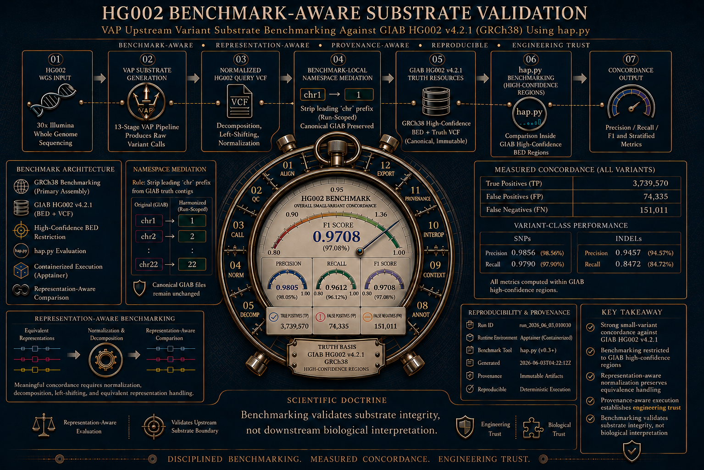

# HG002 Benchmark-Aware Substrate Validation

**Figure 1**. HG002 Benchmark-Aware Substrate Validation. Representation-aware `hap.py` benchmarking and deterministic semantic evidence organization using GIAB HG002 v4.2.1 (GRCh38) truth resources.

---

# Overview

The HG002 case study demonstrates benchmark-aware validation of the VAP upstream variant substrate using representation-aware `hap.py` benchmarking against Genome In A Bottle (GIAB) HG002 v4.2.1 truth resources.

The workflow evaluated concordance inside GIAB high-confidence benchmark regions while preserving:

* deterministic execution,
* provenance-aware normalization,
* representation-aware comparison,
* semantic evidence decomposition,
* interoperability substrate emission.

The HG002 case study therefore serves two complementary purposes:

1. upstream engineering validation of the VAP variant substrate boundary,
2. downstream demonstration of deterministic semantic evidence organization.

Benchmarking validates substrate integrity.
Downstream biological interpretation remains modular, evidence-governed, and semantically separated from benchmark concordance evaluation.

---

# Benchmarking Architecture

The benchmarking workflow evaluated VAP-produced HG002 variant substrates against canonical GIAB HG002 v4.2.1 benchmark resources using `hap.py`.

The evaluation pipeline included:

* deterministic VAP execution,
* normalization and decomposition,
* left-shifting of equivalent representations,
* benchmark-local namespace mediation,
* BED-restricted high-confidence comparison,
* provenance-aware artifact emission.

The benchmarking workflow was intentionally representation-aware.

Equivalent variant representations can differ syntactically despite representing the same biological event. The benchmarking architecture therefore normalized comparison boundaries prior to concordance evaluation.

Namespace mediation was implemented as a benchmark-local overlay layer without mutation of canonical truth resources.

---

# Benchmark Concordance Summary

The HG002 benchmarking workflow demonstrated strong small-variant concordance against GIAB HG002 v4.2.1 truth resources within high-confidence benchmark regions.

## Aggregate Concordance

| Metric    | Value  |
| --------- | ------ |
| Precision | 0.9805 |
| Recall    | 0.9612 |
| F1 score  | 0.9708 |

## Variant-Class Performance

| Variant class | Precision | Recall |
| ------------- | --------- | ------ |
| SNPs          | 0.9856    | 0.9790 |
| INDELs        | 0.9457    | 0.8472 |

The HG002 benchmarking workflow therefore established strong upstream substrate concordance while preserving deterministic downstream semantic evidence organization.

---

# `hap.py` VAP Benchmarking

[**Figure 1**. HG002 Benchmark-Aware Substrate Validation](./figures/hg002_happy_benchmarking.png)

Figure 1 summarizes:

* benchmark-aware normalization,
* representation-aware comparison,
* namespace mediation,
* concordance evaluation,
* deterministic provenance,
* operational telemetry,
* interoperability substrate emission.

Figure 1 intentionally emphasizes engineering trust infrastructure rather than simplistic benchmark-score reporting.

---

# Deterministic Semantic Evidence Organization

[**Figure 2**. Operational Stability and Deterministic Semantics](./figures/hg002_f1_benchmark_operational_stability.png)

Following benchmark-aware validation, VAP emitted deterministic downstream semantic evidence structures spanning:

* coding evidence organization,
* noncoding evidence organization,
* rarity-aware routing,
* interpretability-aware decomposition,
* prioritization layers,
* interoperability substrate generation.

Unlike single-funnel filtering pipelines, VAP preserves semantically distinct evidence classes throughout downstream organization.

The resulting evidence topology included:

* rare interpretable evidence,
* low-support/common evidence,
* uninterpretable evidence surfaces,
* validation-ready evidence routing,
* coding/noncoding decomposition,
* provenance-aware semantic lineage.

This organizational strategy preserves downstream interpretability flexibility while maintaining separation between engineering validation and biological interpretation.

---

# WGS Semantic Topology

HG002 whole-genome sequencing (WGS) generated substantially expanded noncoding semantic evidence surfaces compared to prior epilepsy-focused whole-exome sequencing (WES) case studies.

The HG002 evidence topology demonstrated large-scale expansion of:

* intronic evidence,
* intergenic evidence,
* transcript-associated noncoding evidence,
* flanking regulatory contexts,
* low-interpretability observational surfaces.

This behavior is expected for WGS-scale analysis.

VAP preserves these semantic evidence classes explicitly rather than collapsing them into a single prioritization layer.

The resulting semantic topology demonstrates that VAP can scale from focused coding-oriented WES analysis to substantially larger WGS evidence landscapes while preserving deterministic organizational behavior.

---

# Interoperability Substrate Emission

Stage 08 interoperability infrastructure emitted deterministic downstream substrates for ecosystem reuse.

Representative outputs included:

| Substrate                              | Purpose                                |
| -------------------------------------- | -------------------------------------- |
| RDGP-ready gene evidence substrate     | downstream rare disease prioritization |
| VDB-ready normalized variant substrate | downstream variant warehousing         |
| semantic summary telemetry             | reproducible evidence auditing         |
| prioritization-aware summaries         | downstream evidence routing            |

Representative emitted schema fields included:

* variant context,
* clinical significance,
* population frequency,
* interpretability status,
* functional consequence,
* prioritization labels,
* semantic evidence classification.

The interoperability layer demonstrates that VAP functions as a deterministic semantic substrate-generation platform rather than solely as a variant annotation workflow.

---

# Runtime Observability

Modern instrumented VAP execution emitted runtime telemetry and stage-resolved observability artifacts, including:

* runtime stage summaries,
* execution provenance,
* semantic telemetry,
* deterministic artifact manifests,
* reproducibility metadata.

The runtime observability architecture enabled deterministic regeneration of summary tables, semantic overlays, interoperability substrates, and downstream figures from emitted metric sidecars and structured TSV artifacts.

This observability-oriented design substantially expanded downstream reproducibility and auditability compared to earlier legacy HG002 runs.

---

# Scientific Caveats

Several important scientific caveats apply to the HG002 benchmarking case study.

## Benchmark Scope

`hap.py` benchmarking evaluates concordance against GIAB truth resources inside benchmark high-confidence regions. The benchmarking workflow does not validate downstream biological interpretation.

## Representation Sensitivity

Variant representation equivalence requires normalization, decomposition, and left-shifting prior to comparison. Raw representation differences do not necessarily imply biological disagreement.

## Semantic Interpretation

Semantic evidence organization does not imply diagnosis, pathogenicity, or validation status.

## Noncoding Evidence

Large noncoding evidence surfaces primarily represent observational semantic structures rather than direct clinical assertions.

## Benchmark Context

HG002 represents a benchmarking-oriented reference genome substrate rather than a disease-focused clinical case study.

These constraints are important for maintaining clear separation between engineering validation and downstream biological interpretation.

---

# Representative Artifacts

## Benchmarking

* [`benchmarking/hg002_benchmark_summary.tsv`](./benchmarking/hg002_benchmark_summary.tsv)
* [`benchmarking/hg002_benchmark_summary.json`](./benchmarking/hg002_benchmark_summary.json)
* [`benchmarking/hg002_snp_indel_metrics.tsv`](./benchmarking/hg002_snp_indel_metrics.tsv)
* [`benchmarking/happy/hg002_happy.summary.csv`](./benchmarking/happy/hg002_happy.summary.csv)
* [`benchmarking/happy/hg002_happy.extended.csv`](./benchmarking/happy/hg002_happy.extended.csv)
* [`benchmarking/interoperability/namespace_harmonization_manifest.json`](./benchmarking/interoperability/namespace_harmonization_manifest.json)

## Figures

* [`figures/hg002_happy_benchmarking.png`](./figures/hg002_happy_benchmarking.png)
* [`figures/hg002_f1_benchmark_operational_stability.png`](./figures/hg002_f1_benchmark_operational_stability.png)
* [`figures/hg002_f2_runtime_observability_profile.png`](./figures/hg002_f2_runtime_observability_profile.png)
* [`figures/HG002_f3a_deterministic_evidence_lineage.png`](./figures/HG002_f3a_deterministic_evidence_lineage.png)
* [`figures/HG002_f3b_semantic_branching.png`](./figures/HG002_f3b_semantic_branching.png)
* [`figures/HG002_f4a_clinvar_significance.png`](./figures/HG002_f4a_clinvar_significance.png)
* [`figures/HG002_f4a_consequence.png`](./figures/HG002_f4a_consequence.png)
* [`figures/HG002_f4a_pop_freq_bins.png`](./figures/HG002_f4a_pop_freq_bins.png)
* [`figures/HG002_f4b_clinvar_significance.png`](./figures/HG002_f4b_clinvar_significance.png)
* [`figures/HG002_f4b_consequence.png`](./figures/HG002_f4b_consequence.png)
* [`figures/HG002_f4b_pop_freq_bins.png`](./figures/HG002_f4b_pop_freq_bins.png)
* [`figures/HG002_f5_interoperability_substrates.png`](./figures/HG002_f5_interoperability_substrates.png)

## Semantic Summary Tables

* [`tables/summary/candidate_reviewability_readiness.tsv`](./tables/summary/candidate_reviewability_readiness.tsv)
* [`tables/summary/clinical_status_summary.tsv`](./tables/summary/clinical_status_summary.tsv)
* [`tables/summary/provenance_summary.tsv`](./tables/summary/provenance_summary.tsv)
* [`tables/summary/runtime_stage_summary.tsv`](./tables/summary/runtime_stage_summary.tsv)
* [`tables/summary/variant_consequence_summary.tsv`](./tables/summary/variant_consequence_summary.tsv)

## Runtime Observability Tables

* [`tables/summary/runtime_stage_summary.tsv`](./tables/summary/runtime_stage_summary.tsv)
* [`tables/summary/provenance_summary.tsv`](./tables/summary/provenance_summary.tsv)
* [`tables/summary/run_reproducibility_summary.tsv`](./tables/summary/run_reproducibility_summary.tsv)
* [`tables/summary/stage_funnel_summary.tsv`](./tables/summary/stage_funnel_summary.tsv)

---

# Related Documents

* [`hg002_semantic_evidence_landscape.md`](./hg002_semantic_evidence_landscape.md)
* [`hg002_artifact_navigation_guide.md`](./hg002_artifact_navigation_guide.md)
* [`artifact_inventory.md`](./artifact_inventory.md)
* [`hg002_benchmarking_design_philosophy.md`](./hg002_benchmarking_design_philosophy.md)
* [`hg002_wgs_baseline.md`](./hg002_wgs_baseline.md)

Internal implementation governance and benchmarking evaluation artifacts additionally exist within:

* [`docs/contracts/system/`](../../contracts/system/)
* [`docs/plans/`](../../plans/)
* [`tests/benchmarking/`](../../../tests/benchmarking/)
* [`scripts/benchmarking/`](../../../scripts/benchmarking/)

---

# Key Takeaways

* VAP demonstrated strong small-variant concordance against GIAB HG002 v4.2.1 truth resources using representation-aware `hap.py` benchmarking.
* Deterministic normalization and namespace mediation enabled stable benchmark-aware comparison.
* Modern instrumented VAP execution emitted reproducible runtime telemetry and semantic observability artifacts.
* WGS analysis produced substantially expanded noncoding semantic evidence surfaces while preserving deterministic organizational behavior.
* Interoperability-oriented substrate emission enabled downstream ecosystem reuse through deterministic semantic artifact generation.

The HG002 case study therefore demonstrates both benchmark-aware upstream substrate validation and deterministic downstream semantic evidence organization within the broader VAP architecture.

---

# References

1. Zook JM, McDaniel J, Olson ND, et al. Extensive sequencing of seven human genomes to characterize benchmark reference materials. *Scientific Data*. 2016;3:160025.

2. Kurtzer GM, Sochat V, Bauer MW. Singularity: Scientific containers for mobility of compute. *PLoS ONE*. 2017;12(5):e0177459.

3. Krusche P, Trigg L, Boutros PC, et al. Best practices for benchmarking germline small-variant calls in human genomes. *Nature Biotechnology*. 2019;37(5):555–560.

4. Illumina. hap.py variant benchmarking toolkit. https://github.com/Illumina/hap.py

5. Cleary JG, Braithwaite R, Gaastra K, et al. Comparing variant call files for performance benchmarking of next-generation sequencing variant calling pipelines. *bioRxiv*. 2015. doi:10.1101/023754

6. McLaren W, Gil L, Hunt SE, et al. The Ensembl Variant Effect Predictor. *Genome Biology*. 2016;17:122.

7. Landrum MJ, Lee JM, Benson M, et al. ClinVar: improving access to variant interpretations and supporting evidence. *Nucleic Acids Research*. 2018;46(D1):D1062–D1067.

8. Li H. Toward better understanding of artifacts in variant calling from high-coverage samples. *Bioinformatics*. 2014;30(20):2843–2851.
