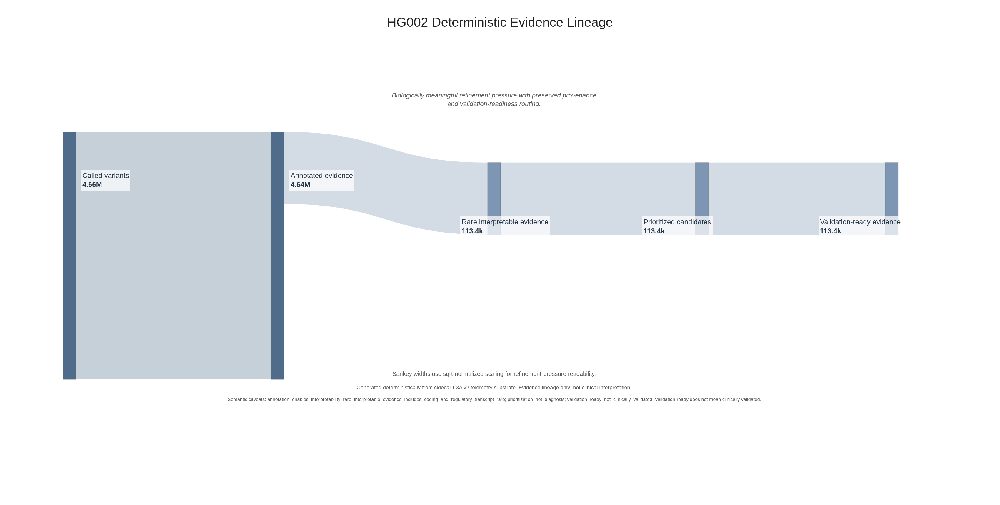
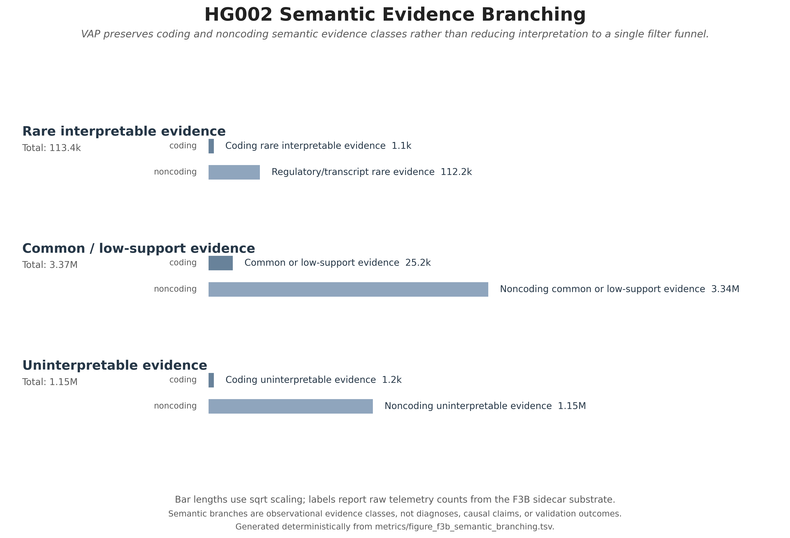
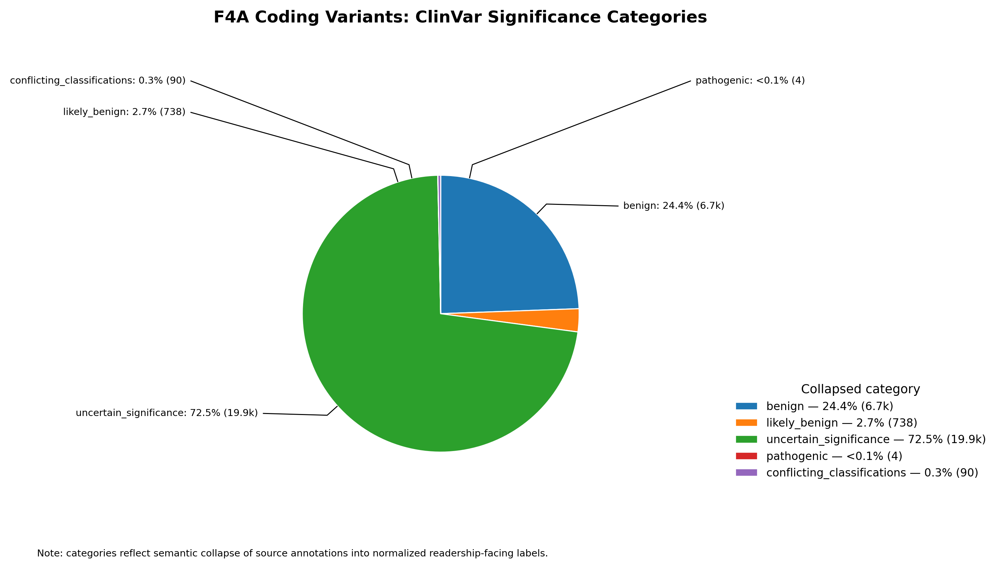
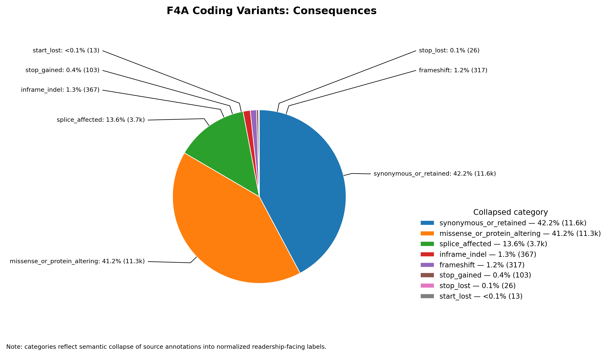
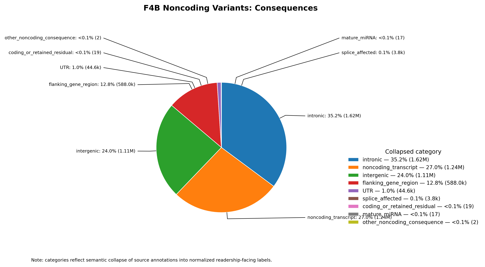
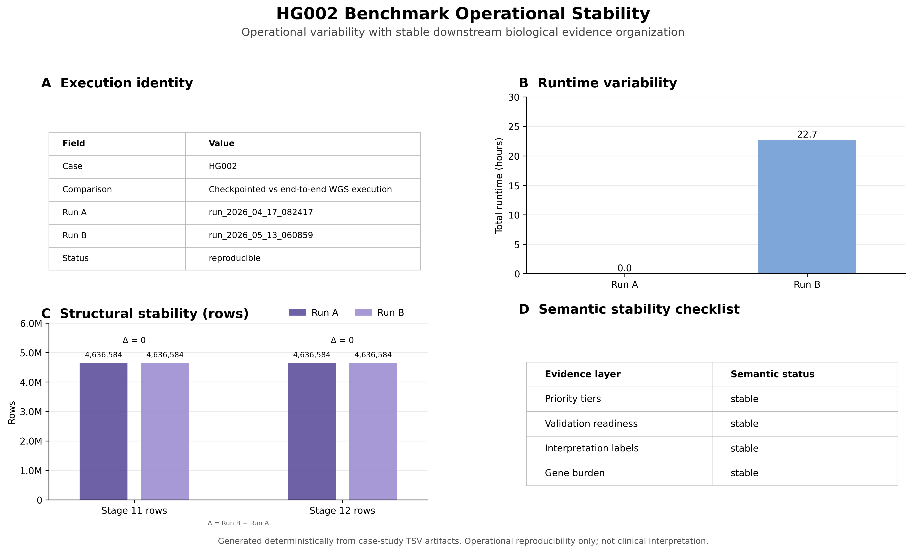
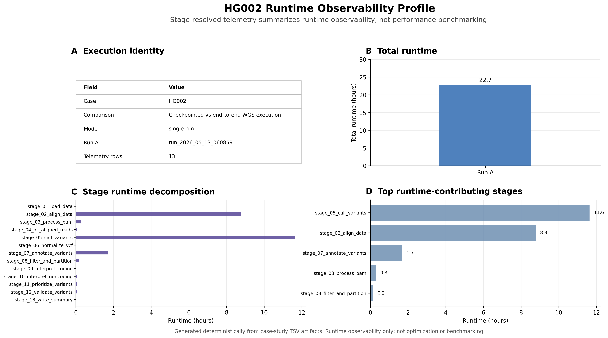
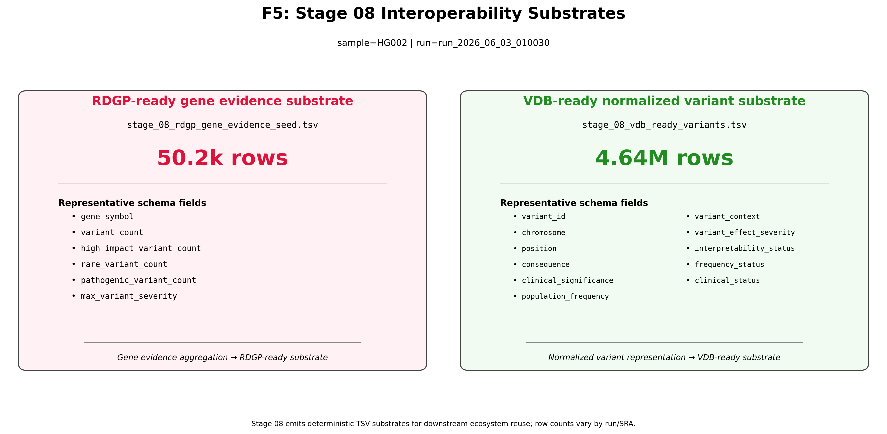

# HG002 Artifact Navigation Guide

This document provides a guided traversal strategy for the HG002 benchmark-aware semantic infrastructure ecosystem.

Whereas the primary [`README.md`](./README.md) provides conceptual synthesis and high-level interpretation, this guide focuses on operational artifact navigation, evidence-surface relationships, and recommended traversal order across benchmarking, semantic, interoperability, and observability artifacts.

The HG002 ecosystem contains four major artifact classes:

| Artifact Class              | Purpose                                       |
| --------------------------- | --------------------------------------------- |
| Benchmarking artifacts      | upstream substrate concordance validation     |
| Semantic evidence artifacts | downstream semantic decomposition and routing |
| Observability artifacts     | provenance-aware runtime introspection        |
| Interoperability artifacts  | downstream ecosystem substrate emission       |

The traversal strategy below progressively moves from upstream engineering validation toward downstream semantic evidence organization.

---

# Recommended Reading Order

## 1. Primary README

Start with:

[README.md](README.md)

Purpose:

* establish HG002 positioning,
* understand benchmarking philosophy,
* review benchmark concordance,
* understand interoperability-oriented substrate generation.

The README acts as the primary conceptual entrypoint into the HG002 ecosystem.

---

# 2. Hero Figure

Primary visualization:

* [`figures/hg002_happy_benchmarking.png`](./figures/hg002_happy_benchmarking.png)

Purpose:

* summarize benchmark-aware substrate validation,
* visualize representation-aware comparison,
* demonstrate namespace mediation,
* illustrate provenance-aware benchmarking,
* establish engineering trust boundaries.

This figure functions as the primary visual synthesis surface for the HG002 case study.

---

# 3. Core Benchmarking Surfaces

Recommended artifacts:

* [`benchmarking/hg002_benchmark_summary.tsv`](./benchmarking/hg002_benchmark_summary.tsv)
* [`benchmarking/hg002_snp_indel_metrics.tsv`](./benchmarking/hg002_snp_indel_metrics.tsv)
* [`benchmarking/happy/hg002_happy.summary.csv`](./benchmarking/happy/hg002_happy.summary.csv)
* [`benchmarking/interoperability/namespace_harmonization_manifest.json`](./benchmarking/interoperability/namespace_harmonization_manifest.json)

Purpose:

* evaluate upstream concordance,
* inspect SNP vs INDEL behavior,
* review aggregate precision/recall/F1 metrics,
* understand benchmark-local namespace mediation.

These artifacts establish engineering confidence in the upstream VAP substrate boundary.

---

# 4. Semantic Evidence Architecture

* [`figures/HG002_f3a_deterministic_evidence_lineage.png`](./figures/HG002_f3a_deterministic_evidence_lineage.png)

* [`figures/HG002_f3b_semantic_branching.png`](./figures/HG002_f3b_semantic_branching.png)

Purpose:

* inspect deterministic evidence lineage,
* review semantic decomposition behavior,
* understand coding/noncoding evidence routing,
* evaluate preservation of downstream semantic structure.

These figures demonstrate that VAP preserves semantically distinct evidence classes rather than collapsing downstream interpretation into a single filtering funnel.

---

# 5. WGS Semantic Topology

Recommended figures:

* [`figures/HG002_f4a_clinvar_significance.png`](./figures/HG002_f4a_clinvar_significance.png)

* [`figures/HG002_f4a_consequence.png`](./figures/HG002_f4a_consequence.png)

* [`figures/HG002_f4b_consequence.png`](./figures/HG002_f4b_consequence.png)

Recommended summary surfaces:

* [`tables/summary/coding_noncoding_consequence_summary.tsv`](./tables/summary/coding_noncoding_consequence_summary.tsv)
* [`tables/summary/variant_consequence_summary.tsv`](./tables/summary/variant_consequence_summary.tsv)
* [`tables/value_counts/value_counts__consequence.tsv`](./tables/value_counts/value_counts__consequence.tsv)

Purpose:

* inspect WGS-scale evidence topology,
* review coding vs noncoding evidence expansion,
* understand semantic burden scaling relative to WES analysis environments.

These surfaces demonstrate the substantially expanded semantic evidence space encountered within WGS analysis.

---

# 6. Telemetry Surfaces

## Operational Reproducibility Surface

Supporting figure:

* [`figures/hg002_f1_benchmark_operational_stability.png`](./figures/hg002_f1_benchmark_operational_stability.png)

Purpose:

* demonstrate deterministic rerun behavior,
* inspect substrate preservation across independent executions,
* validate stable semantic evidence organization,
* illustrate zero-delta reproducibility behavior within modern VAP infrastructure.

---

## Runtime Observability Surface

Recommended artifacts:

* [`tables/summary/runtime_stage_summary.tsv`](./tables/summary/runtime_stage_summary.tsv)
* [`tables/summary/provenance_summary.tsv`](./tables/summary/provenance_summary.tsv)
* [`tables/summary/run_reproducibility_summary.tsv`](./tables/summary/run_reproducibility_summary.tsv)
* [`tables/summary/stage_funnel_summary.tsv`](./tables/summary/stage_funnel_summary.tsv)

Recommended figure:

* [`figures/hg002_f2_runtime_observability_profile.png`](./figures/hg002_f2_runtime_observability_profile.png)

Purpose:

* inspect stage-resolved telemetry,
* review provenance-aware execution summaries,
* evaluate deterministic operational continuity across HG002 generations,
* understand modern instrumented VAP observability architecture.

These surfaces demonstrate the transition from earlier minimally observable VAP generations toward provenance-aware operational introspection and reproducible artifact regeneration.

---

# 7. Interoperability Substrate Emission

* [`figures/HG002_f5_interoperability_substrates.png`](./figures/HG002_f5_interoperability_substrates.png)

Recommended artifacts:

* [`tables/summary/gene_list_overlay_intersections.tsv`](./tables/summary/gene_list_overlay_intersections.tsv)
* [`tables/summary/overlay_gene_coding_clinical_evidence.tsv`](./tables/summary/overlay_gene_coding_clinical_evidence.tsv)
* [`tables/summary/overlay_gene_coding_frequency_profiles.tsv`](./tables/summary/overlay_gene_coding_frequency_profiles.tsv)
* [`tables/summary/overlay_gene_coding_functional_impact.tsv`](./tables/summary/overlay_gene_coding_functional_impact.tsv)

Purpose:

* inspect downstream interoperability-oriented substrate generation,
* evaluate semantic overlay integration,
* review RDGP-ready and VDB-ready evidence organization surfaces.

These artifacts demonstrate that VAP functions as a deterministic semantic substrate-generation platform rather than solely as a variant annotation workflow.

---

# 8. Candidate Reviewability Surfaces

Recommended artifacts:

* [`tables/lane_candidate_slices/`](./tables/lane_candidate_slices/)
* [`tables/lane_candidate_slices/HG002_bucket_1a_validation_routed_epilepsy_mito.tsv`](./tables/lane_candidate_slices/HG002_bucket_1a_validation_routed_epilepsy_mito.tsv)
* [`tables/lane_candidate_slices/HG002_bucket_2a_rare_impact_coding_triage_summary.tsv`](./tables/lane_candidate_slices/HG002_bucket_2a_rare_impact_coding_triage_summary.tsv)
* [`tables/lane_candidate_slices/HG002_bucket_4a_representative_noncoding_semantic_exemplars.tsv`](./tables/lane_candidate_slices/HG002_bucket_4a_representative_noncoding_semantic_exemplars.tsv)

* [`tables/summary/candidate_reviewability_readiness.tsv`](./tables/summary/candidate_reviewability_readiness.tsv)
* [`tables/summary/priority_tier_summary.tsv`](./tables/summary/priority_tier_summary.tsv)

Purpose:

* inspect deterministic evidence prioritization,
* review validation-oriented routing behavior,
* evaluate bounded interpretability organization.

These surfaces demonstrate how VAP preserves semantically structured downstream evidence organization while separating interpretability, prioritization, and validation-readiness layers.

---

# Important Interpretation Constraints

Several important interpretation constraints apply throughout the HG002 artifact ecosystem.

## Benchmarking Scope

Benchmark concordance evaluates upstream engineering agreement against GIAB truth resources inside high-confidence benchmark regions.

Benchmarking does not establish diagnosis, pathogenicity, or downstream biological truth.

---

## Semantic Organization

Semantic evidence decomposition and prioritization preserve organizational topology rather than clinical certainty.

Observed evidence classes remain observational unless independently validated in downstream contexts.

---

## Noncoding Expansion

Large noncoding evidence surfaces are expected for WGS analysis and primarily represent expanded semantic observability rather than direct biological assertions.

---

## Engineering Validation vs Biological Interpretation

The HG002 ecosystem primarily demonstrates:

* benchmark-aware substrate generation,
* deterministic semantic organization,
* provenance-aware observability,
* interoperability-oriented artifact emission.

Biological interpretation remains modular and downstream of the benchmarking boundary.

---

# Related Documents

## Conceptual Synthesis

* [`README.md`](./README.md)

## Scientific Interpretation

* [`hg002_semantic_evidence_landscape.md`](./hg002_semantic_evidence_landscape.md)

## Design Philosophy

* [`hg002_benchmarking_design_philosophy.md`](./hg002_benchmarking_design_philosophy.md)

## Historical Operational Baseline

* [`hg002_wgs_baseline.md`](./hg002_wgs_baseline.md)

## Governance and Implementation

* [`docs/contracts/system/`](../../contracts/system/)
* [`docs/plans/`](../../plans/)
* [`scripts/benchmarking/`](../../../scripts/benchmarking/)
* [`tests/benchmarking/`](../../../tests/benchmarking/)

Together, these documents provide a layered navigation architecture spanning benchmark-aware validation, semantic evidence organization, operational observability, and interoperability-oriented substrate generation within the VAP ecosystem.

---

# Related HG002 Documents

* [`README.md`](./README.md)
* [`hg002_artifact_navigation_guide.md`](./hg002_artifact_navigation_guide.md)
* [`artifact_inventory.md`](./artifact_inventory.md)
* [`hg002_semantic_evidence_landscape.md`](./hg002_semantic_evidence_landscape.md)
* [`hg002_benchmarking_design_philosophy.md`](./hg002_benchmarking_design_philosophy.md)
* [`hg002_wgs_baseline.md`](./hg002_wgs_baseline.md)